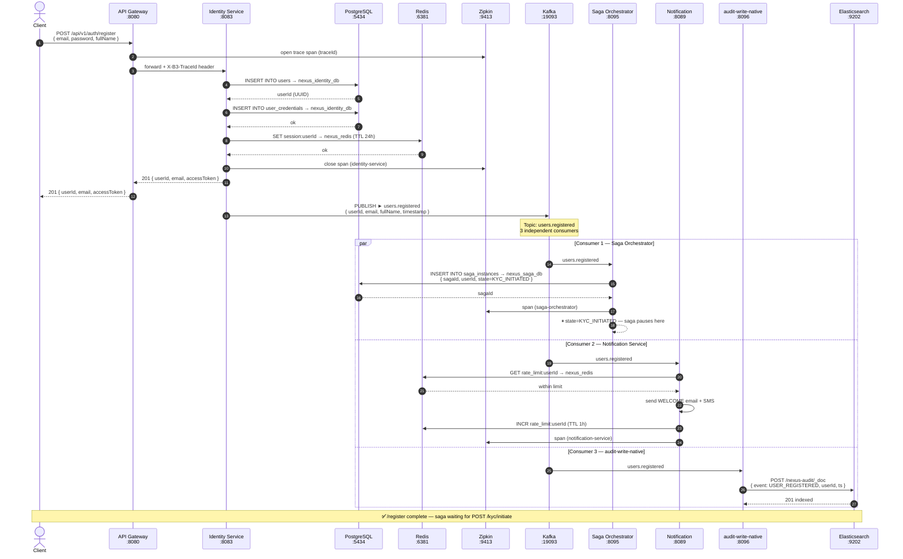

```mermaid
sequenceDiagram
    autonumber
    actor Client
    participant GW as API Gateway<br/>:8080
    participant ID as Identity Service<br/>:8083
    participant PG as PostgreSQL<br/>:5434
    participant RD as Redis<br/>:6381
    participant ZP as Zipkin<br/>:9413
    participant K as Kafka<br/>:19093
    participant SO as Saga Orchestrator<br/>:8095
    participant NOT as Notification<br/>:8089
    participant AUD as audit-write-native<br/>:8096
    participant ES as Elasticsearch<br/>:9202

    Client->>GW: POST /api/v1/auth/register<br/>{ email, password, fullName }
    GW->>ZP: open trace span (traceId)
    GW->>ID: forward + X-B3-TraceId header

    ID->>PG: INSERT INTO users → nexus_identity_db
    PG-->>ID: userId (UUID)
    ID->>PG: INSERT INTO user_credentials → nexus_identity_db
    PG-->>ID: ok
    ID->>RD: SET session:userId → nexus_redis (TTL 24h)
    RD-->>ID: ok
    ID->>ZP: close span (identity-service)
    ID-->>GW: 201 { userId, email, accessToken }
    GW-->>Client: 201 { userId, email, accessToken }

    ID->>K: PUBLISH ► users.registered<br/>{ userId, email, fullName, timestamp }

    Note over K: Topic: users.registered<br/>3 independent consumers

    par Consumer 1 — Saga Orchestrator
        K->>SO: users.registered
        SO->>PG: INSERT INTO saga_instances → nexus_saga_db<br/>{ sagaId, userId, state=KYC_INITIATED }
        PG-->>SO: sagaId
        SO->>ZP: span (saga-orchestrator)
        SO-->>SO: ⏸ state=KYC_INITIATED — saga pauses here
    and Consumer 2 — Notification Service
        K->>NOT: users.registered
        NOT->>RD: GET rate_limit:userId → nexus_redis
        RD-->>NOT: within limit
        NOT->>NOT: send WELCOME email + SMS
        NOT->>RD: INCR rate_limit:userId (TTL 1h)
        NOT->>ZP: span (notification-service)
    and Consumer 3 — audit-write-native
        K->>AUD: users.registered
        AUD->>ES: POST /nexus-audit/_doc<br/>{ event: USER_REGISTERED, userId, ts }
        ES-->>AUD: 201 indexed
    end

    Note over Client,ES: ✅ /register complete — saga waiting for POST /kyc/initiate
```
