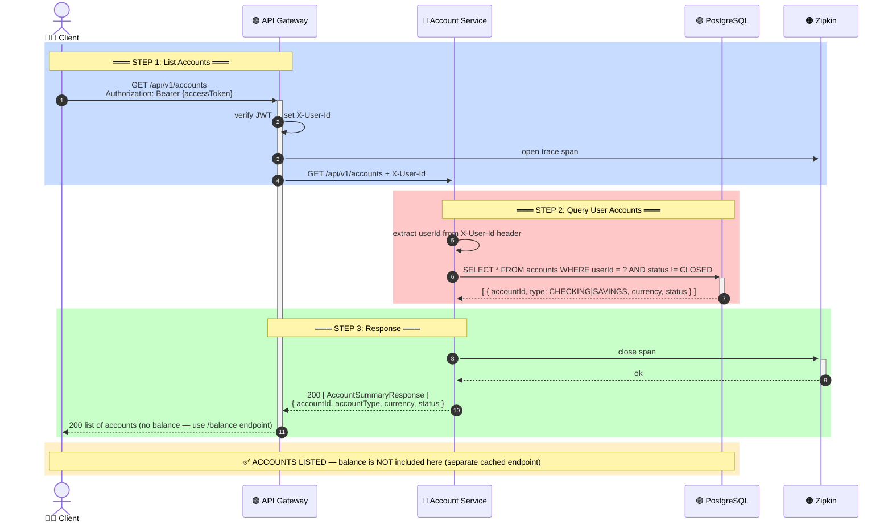

```mermaid
sequenceDiagram
    autonumber
    actor Client as 🧑‍💻 Client
    participant GW as 🟢 API Gateway
    participant AC as 🔵 Account Service
    participant PG as 🟣 PostgreSQL
    participant ZP as 🟠 Zipkin

    rect rgb(200, 220, 255)
        Note over Client,GW: ═══ STEP 1: List Accounts ═══
        Client->>+GW: GET /api/v1/accounts<br/>Authorization: Bearer {accessToken}
        GW->>GW: verify JWT → set X-User-Id
        GW->>+ZP: open trace span
        GW->>+AC: GET /api/v1/accounts + X-User-Id
    end

    rect rgb(255, 200, 200)
        Note over AC,PG: ═══ STEP 2: Query User Accounts ═══
        AC->>AC: extract userId from X-User-Id header
        AC->>+PG: SELECT * FROM accounts WHERE userId = ? AND status != CLOSED
        PG-->>-AC: [ { accountId, type: CHECKING|SAVINGS, currency, status } ]
    end

    rect rgb(200, 255, 200)
        Note over AC,GW: ═══ STEP 3: Response ═══
        AC->>+ZP: close span
        ZP-->>-AC: ok
        AC-->>GW: 200 [ AccountSummaryResponse ]<br/>{ accountId, accountType, currency, status }
        GW-->>-Client: 200 list of accounts (no balance — use /balance endpoint)
    end

    rect rgb(255, 240, 200)
        Note over Client,PG: ✅ ACCOUNTS LISTED — balance is NOT included here (separate cached endpoint)
    end
```
