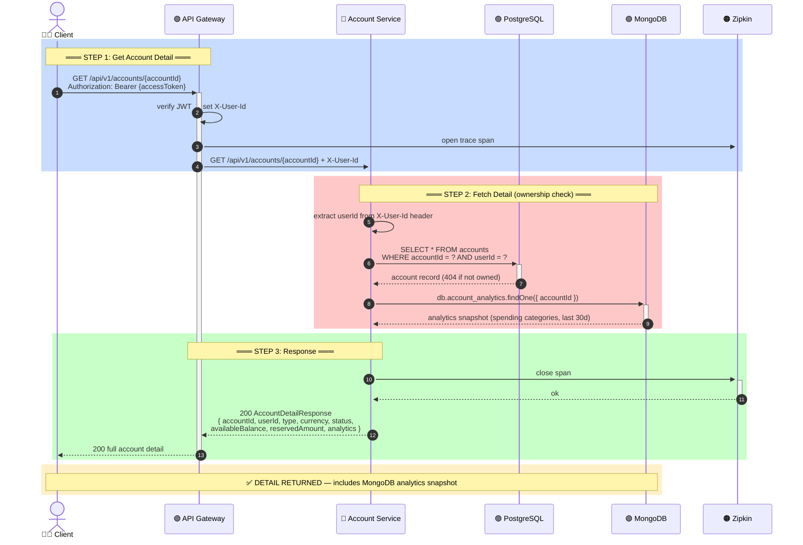

```mermaid
sequenceDiagram
    autonumber
    actor Client as 🧑‍💻 Client
    participant GW as 🟢 API Gateway
    participant AC as 🔵 Account Service
    participant PG as 🟣 PostgreSQL
    participant MDB as 🟢 MongoDB
    participant ZP as 🟠 Zipkin

    rect rgb(200, 220, 255)
        Note over Client,GW: ═══ STEP 1: Get Account Detail ═══
        Client->>+GW: GET /api/v1/accounts/{accountId}<br/>Authorization: Bearer {accessToken}
        GW->>GW: verify JWT → set X-User-Id
        GW->>+ZP: open trace span
        GW->>+AC: GET /api/v1/accounts/{accountId} + X-User-Id
    end

    rect rgb(255, 200, 200)
        Note over AC,MDB: ═══ STEP 2: Fetch Detail (ownership check) ═══
        AC->>AC: extract userId from X-User-Id header
        AC->>+PG: SELECT * FROM accounts<br/>WHERE accountId = ? AND userId = ?
        PG-->>-AC: account record (404 if not owned)
        AC->>+MDB: db.account_analytics.findOne({ accountId })
        MDB-->>-AC: analytics snapshot (spending categories, last 30d)
    end

    rect rgb(200, 255, 200)
        Note over AC,GW: ═══ STEP 3: Response ═══
        AC->>+ZP: close span
        ZP-->>-AC: ok
        AC-->>GW: 200 AccountDetailResponse<br/>{ accountId, userId, type, currency, status,<br/>  availableBalance, reservedAmount, analytics }
        GW-->>-Client: 200 full account detail
    end

    rect rgb(255, 240, 200)
        Note over Client,MDB: ✅ DETAIL RETURNED — includes MongoDB analytics snapshot
    end
```
