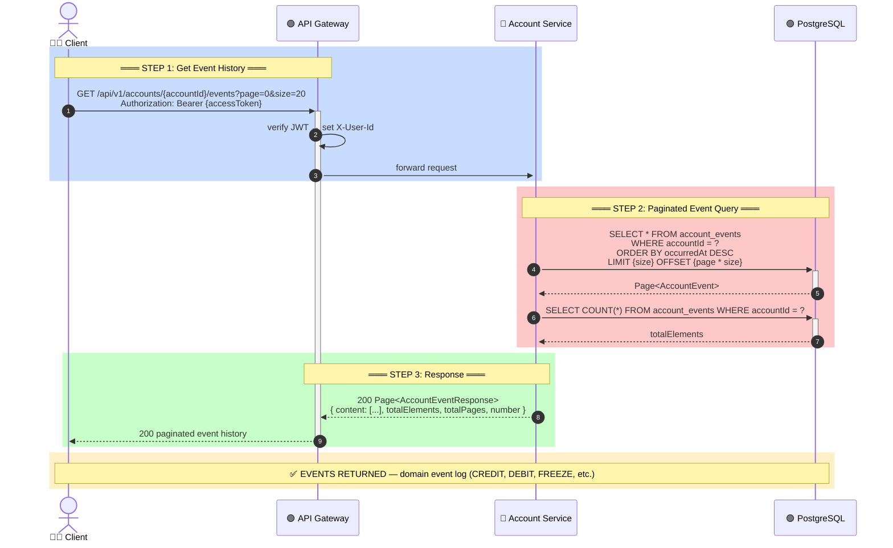

```mermaid
sequenceDiagram
    autonumber
    actor Client as 🧑‍💻 Client
    participant GW as 🟢 API Gateway
    participant AC as 🔵 Account Service
    participant PG as 🟣 PostgreSQL

    rect rgb(200, 220, 255)
        Note over Client,GW: ═══ STEP 1: Get Event History ═══
        Client->>+GW: GET /api/v1/accounts/{accountId}/events?page=0&size=20<br/>Authorization: Bearer {accessToken}
        GW->>GW: verify JWT → set X-User-Id
        GW->>+AC: forward request
    end

    rect rgb(255, 200, 200)
        Note over AC,PG: ═══ STEP 2: Paginated Event Query ═══
        AC->>+PG: SELECT * FROM account_events<br/>WHERE accountId = ?<br/>ORDER BY occurredAt DESC<br/>LIMIT {size} OFFSET {page * size}
        PG-->>-AC: Page<AccountEvent>
        AC->>+PG: SELECT COUNT(*) FROM account_events WHERE accountId = ?
        PG-->>-AC: totalElements
    end

    rect rgb(200, 255, 200)
        Note over AC,GW: ═══ STEP 3: Response ═══
        AC-->>GW: 200 Page<AccountEventResponse><br/>{ content: [...], totalElements, totalPages, number }
        GW-->>-Client: 200 paginated event history
    end

    rect rgb(255, 240, 200)
        Note over Client,PG: ✅ EVENTS RETURNED — domain event log (CREDIT, DEBIT, FREEZE, etc.)
    end
```
