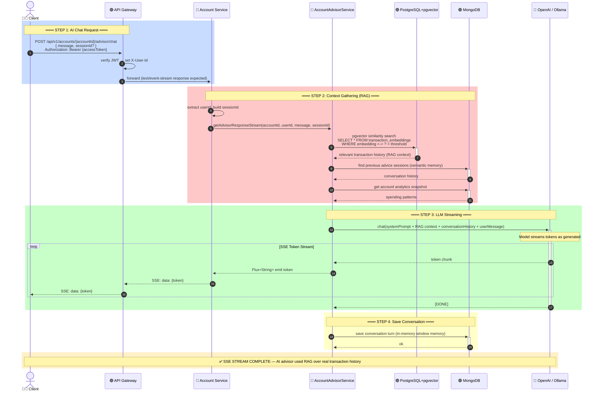

```mermaid
sequenceDiagram
    autonumber
    actor Client as 🧑‍💻 Client
    participant GW as 🟢 API Gateway
    participant AC as 🔵 Account Service
    participant AI as 🤖 AccountAdvisorService
    participant PGV as 🟣 PostgreSQL+pgvector
    participant MDB as 🟢 MongoDB
    participant LLM as 🧠 OpenAI / Ollama

    rect rgb(200, 220, 255)
        Note over Client,GW: ═══ STEP 1: AI Chat Request ═══
        Client->>+GW: POST /api/v1/accounts/{accountId}/advisor/chat<br/>{ message, sessionId? }<br/>Authorization: Bearer {accessToken}
        GW->>GW: verify JWT → set X-User-Id
        GW->>+AC: forward (text/event-stream response expected)
    end

    rect rgb(255, 200, 200)
        Note over AC,MDB: ═══ STEP 2: Context Gathering (RAG) ═══
        AC->>AC: extract userId, build sessionId
        AC->>+AI: getAdvisorResponseStream(accountId, userId, message, sessionId)
        AI->>+PGV: pgvector similarity search<br/>SELECT * FROM transaction_embeddings<br/>WHERE embedding <-> ? < threshold
        PGV-->>-AI: relevant transaction history (RAG context)
        AI->>+MDB: find previous advice sessions (semantic memory)
        MDB-->>-AI: conversation history
        AI->>+MDB: get account analytics snapshot
        MDB-->>-AI: spending patterns
    end

    rect rgb(200, 255, 200)
        Note over AI,LLM: ═══ STEP 3: LLM Streaming ═══
        AI->>+LLM: chat(systemPrompt + RAG context + conversationHistory + userMessage)
        Note over LLM: Model streams tokens as generated
        loop SSE Token Stream
            LLM-->>AI: token chunk
            AI-->>AC: Flux<String> emit token
            AC-->>GW: SSE: data: {token}
            GW-->>Client: SSE: data: {token}
        end
        LLM-->>-AI: [DONE]
    end

    rect rgb(255, 255, 200)
        Note over AI,MDB: ═══ STEP 4: Save Conversation ═══
        AI->>+MDB: save conversation turn (in-memory window memory)
        MDB-->>-AI: ok
    end

    rect rgb(255, 240, 200)
        Note over Client,LLM: ✅ SSE STREAM COMPLETE — AI advisor used RAG over real transaction history
    end
```
