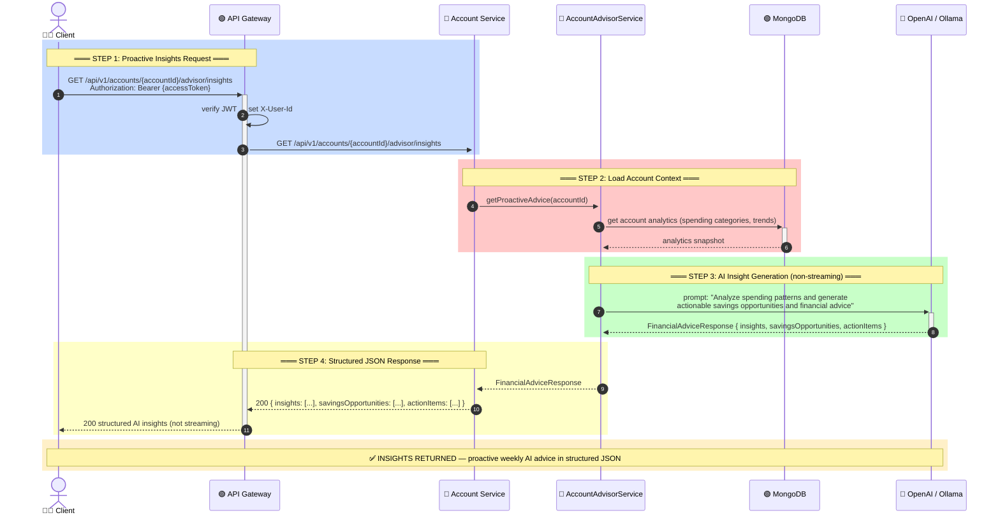

```mermaid
sequenceDiagram
    autonumber
    actor Client as 🧑‍💻 Client
    participant GW as 🟢 API Gateway
    participant AC as 🔵 Account Service
    participant AI as 🤖 AccountAdvisorService
    participant MDB as 🟢 MongoDB
    participant LLM as 🧠 OpenAI / Ollama

    rect rgb(200, 220, 255)
        Note over Client,GW: ═══ STEP 1: Proactive Insights Request ═══
        Client->>+GW: GET /api/v1/accounts/{accountId}/advisor/insights<br/>Authorization: Bearer {accessToken}
        GW->>GW: verify JWT → set X-User-Id
        GW->>+AC: GET /api/v1/accounts/{accountId}/advisor/insights
    end

    rect rgb(255, 200, 200)
        Note over AC,MDB: ═══ STEP 2: Load Account Context ═══
        AC->>+AI: getProactiveAdvice(accountId)
        AI->>+MDB: get account analytics (spending categories, trends)
        MDB-->>-AI: analytics snapshot
    end

    rect rgb(200, 255, 200)
        Note over AI,LLM: ═══ STEP 3: AI Insight Generation (non-streaming) ═══
        AI->>+LLM: prompt: "Analyze spending patterns and generate<br/>actionable savings opportunities and financial advice"
        LLM-->>-AI: FinancialAdviceResponse { insights, savingsOpportunities, actionItems }
    end

    rect rgb(255, 255, 200)
        Note over AC,GW: ═══ STEP 4: Structured JSON Response ═══
        AI-->>AC: FinancialAdviceResponse
        AC-->>GW: 200 { insights: [...], savingsOpportunities: [...], actionItems: [...] }
        GW-->>-Client: 200 structured AI insights (not streaming)
    end

    rect rgb(255, 240, 200)
        Note over Client,LLM: ✅ INSIGHTS RETURNED — proactive weekly AI advice in structured JSON
    end
```
