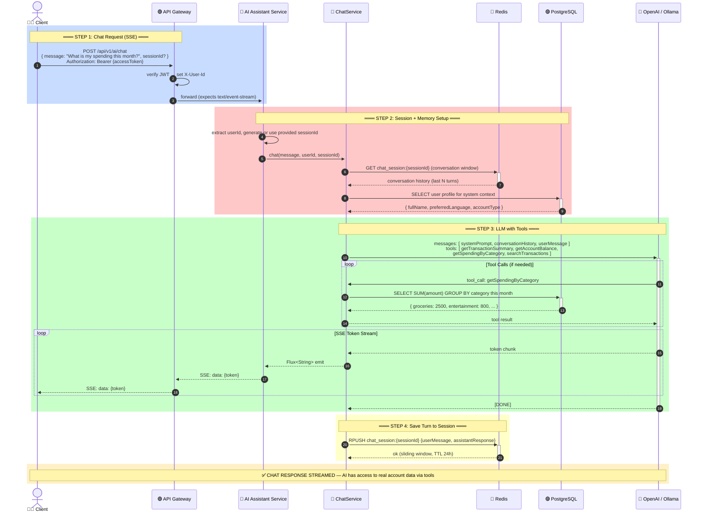

```mermaid
sequenceDiagram
    autonumber
    actor Client as 🧑‍💻 Client
    participant GW as 🟢 API Gateway
    participant AS as 🤖 AI Assistant Service
    participant CS as 🧠 ChatService
    participant RD as 🔴 Redis
    participant PG as 🟣 PostgreSQL
    participant LLM as 🧠 OpenAI / Ollama

    rect rgb(200, 220, 255)
        Note over Client,GW: ═══ STEP 1: Chat Request (SSE) ═══
        Client->>+GW: POST /api/v1/ai/chat<br/>{ message: "What is my spending this month?", sessionId? }<br/>Authorization: Bearer {accessToken}
        GW->>GW: verify JWT → set X-User-Id
        GW->>+AS: forward (expects text/event-stream)
    end

    rect rgb(255, 200, 200)
        Note over AS,PG: ═══ STEP 2: Session + Memory Setup ═══
        AS->>AS: extract userId, generate or use provided sessionId
        AS->>+CS: chat(message, userId, sessionId)
        CS->>+RD: GET chat_session:{sessionId} (conversation window)
        RD-->>-CS: conversation history (last N turns)
        CS->>+PG: SELECT user profile for system context
        PG-->>-CS: { fullName, preferredLanguage, accountType }
    end

    rect rgb(200, 255, 200)
        Note over CS,LLM: ═══ STEP 3: LLM with Tools ═══
        CS->>+LLM: messages: [ systemPrompt, conversationHistory, userMessage ]<br/>tools: [ getTransactionSummary, getAccountBalance,<br/>         getSpendingByCategory, searchTransactions ]
        loop Tool Calls (if needed)
            LLM->>CS: tool_call: getSpendingByCategory
            CS->>+PG: SELECT SUM(amount) GROUP BY category this month
            PG-->>-CS: { groceries: 2500, entertainment: 800, ... }
            CS-->>LLM: tool result
        end
        loop SSE Token Stream
            LLM-->>CS: token chunk
            CS-->>AS: Flux<String> emit
            AS-->>GW: SSE: data: {token}
            GW-->>Client: SSE: data: {token}
        end
        LLM-->>-CS: [DONE]
    end

    rect rgb(255, 255, 200)
        Note over CS,RD: ═══ STEP 4: Save Turn to Session ═══
        CS->>+RD: RPUSH chat_session:{sessionId} {userMessage, assistantResponse}
        RD-->>-CS: ok (sliding window, TTL 24h)
    end

    rect rgb(255, 240, 200)
        Note over Client,LLM: ✅ CHAT RESPONSE STREAMED — AI has access to real account data via tools
    end
```
