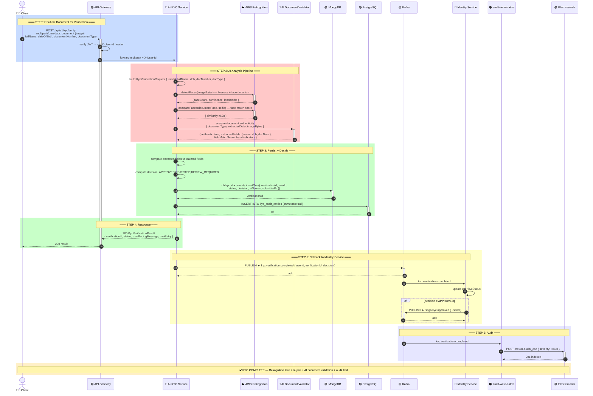

```mermaid
sequenceDiagram
    autonumber
    actor Client as 🧑‍💻 Client
    participant GW as 🟢 API Gateway
    participant KYC as 🔵 AI-KYC Service
    participant RK as ☁️ AWS Rekognition
    participant LLM as 🧠 AI Document Validator
    participant MDB as 🟢 MongoDB
    participant PG as 🟣 PostgreSQL
    participant K as 🟡 Kafka
    participant ID as 🔵 Identity Service
    participant AUD as 🟠 audit-write-native
    participant ES as 🟣 Elasticsearch

    rect rgb(200, 220, 255)
        Note over Client,GW: ═══ STEP 1: Submit Document for Verification ═══
        Client->>+GW: POST /api/v1/kyc/verify<br/>multipart/form-data: document (image),<br/>fullName, dateOfBirth, documentNumber, documentType
        GW->>GW: verify JWT → set X-User-Id header
        GW->>+KYC: forward multipart + X-User-Id
    end

    rect rgb(255, 200, 200)
        Note over KYC,LLM: ═══ STEP 2: AI Analysis Pipeline ═══
        KYC->>KYC: build KycVerificationRequest { userId, fullName, dob, docNumber, docType }
        KYC->>+RK: detectFaces(imageBytes) — liveness + face detection
        RK-->>-KYC: { faceCount, confidence, landmarks }
        KYC->>+RK: compareFaces(documentFace, selfie) — face match score
        RK-->>-KYC: { similarity: 0.98 }
        KYC->>+LLM: analyze document authenticity<br/>{ documentType, extractedData, imageBytes }
        LLM-->>-KYC: { authentic: true, extractedFields: { name, dob, docNum },<br/>  fieldMatchScore, fraudIndicators }
    end

    rect rgb(200, 255, 200)
        Note over KYC,PG: ═══ STEP 3: Persist + Decide ═══
        KYC->>KYC: compare extracted fields vs claimed fields
        KYC->>KYC: compute decision: APPROVED|REJECTED|REVIEW_REQUIRED
        KYC->>+MDB: db.kyc_documents.insertOne({ verificationId, userId,<br/>  status, decision, aiScores, submittedAt })
        MDB-->>-KYC: verificationId
        KYC->>+PG: INSERT INTO kyc_audit_entries (immutable trail)
        PG-->>-KYC: ok
    end

    rect rgb(200, 255, 200)
        Note over KYC,GW: ═══ STEP 4: Response ═══
        KYC-->>GW: 200 KycVerificationResult<br/>{ verificationId, status, userFacingMessage, canRetry }
        GW-->>-Client: 200 result
    end

    rect rgb(255, 255, 200)
        Note over KYC,ID: ═══ STEP 5: Callback to Identity Service ═══
        KYC->>+K: PUBLISH ► kyc.verification.completed { userId, verificationId, decision }
        K-->>-KYC: ack
        K->>+ID: kyc.verification.completed
        ID->>ID: update user kycStatus
        alt decision = APPROVED
            ID->>+K: PUBLISH ► saga.kyc.approved { userId }
            K-->>-ID: ack
        end
    end

    rect rgb(230, 230, 255)
        Note over K,ES: ═══ STEP 6: Audit ═══
        K->>+AUD: kyc.verification.completed
        AUD->>+ES: POST /nexus-audit/_doc { severity: HIGH }
        ES-->>-AUD: 201 indexed
    end

    rect rgb(255, 240, 200)
        Note over Client,ES: ✅ KYC COMPLETE — Rekognition face analysis + AI document validation + audit trail
    end
```
