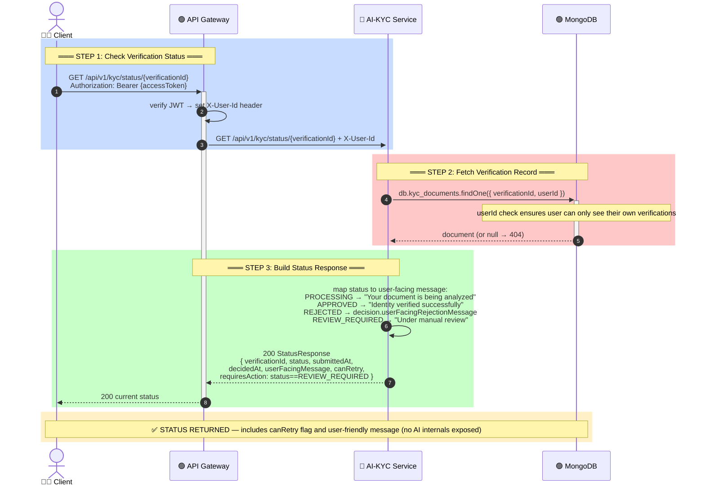

```mermaid
sequenceDiagram
    autonumber
    actor Client as 🧑‍💻 Client
    participant GW as 🟢 API Gateway
    participant KYC as 🔵 AI-KYC Service
    participant MDB as 🟢 MongoDB

    rect rgb(200, 220, 255)
        Note over Client,GW: ═══ STEP 1: Check Verification Status ═══
        Client->>+GW: GET /api/v1/kyc/status/{verificationId}<br/>Authorization: Bearer {accessToken}
        GW->>GW: verify JWT → set X-User-Id header
        GW->>+KYC: GET /api/v1/kyc/status/{verificationId} + X-User-Id
    end

    rect rgb(255, 200, 200)
        Note over KYC,MDB: ═══ STEP 2: Fetch Verification Record ═══
        KYC->>+MDB: db.kyc_documents.findOne({ verificationId, userId })
        Note over MDB: userId check ensures user can only see their own verifications
        MDB-->>-KYC: document (or null → 404)
    end

    rect rgb(200, 255, 200)
        Note over KYC,GW: ═══ STEP 3: Build Status Response ═══
        KYC->>KYC: map status to user-facing message:<br/>PROCESSING → "Your document is being analyzed"<br/>APPROVED → "Identity verified successfully"<br/>REJECTED → decision.userFacingRejectionMessage<br/>REVIEW_REQUIRED → "Under manual review"
        KYC-->>GW: 200 StatusResponse<br/>{ verificationId, status, submittedAt,<br/>  decidedAt, userFacingMessage, canRetry,<br/>  requiresAction: status==REVIEW_REQUIRED }
        GW-->>-Client: 200 current status
    end

    rect rgb(255, 240, 200)
        Note over Client,MDB: ✅ STATUS RETURNED — includes canRetry flag and user-friendly message (no AI internals exposed)
    end
```
