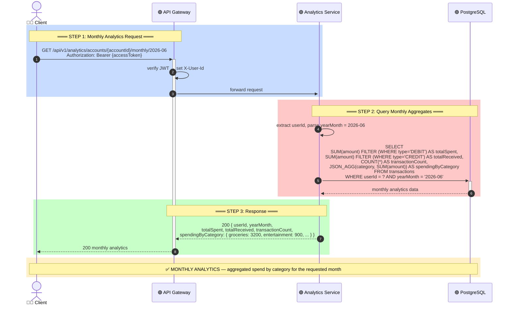

```mermaid
sequenceDiagram
    autonumber
    actor Client as 🧑‍💻 Client
    participant GW as 🟢 API Gateway
    participant AN as 🟢 Analytics Service
    participant PG as 🟣 PostgreSQL

    rect rgb(200, 220, 255)
        Note over Client,GW: ═══ STEP 1: Monthly Analytics Request ═══
        Client->>+GW: GET /api/v1/analytics/accounts/{accountId}/monthly/2026-06<br/>Authorization: Bearer {accessToken}
        GW->>GW: verify JWT → set X-User-Id
        GW->>+AN: forward request
    end

    rect rgb(255, 200, 200)
        Note over AN,PG: ═══ STEP 2: Query Monthly Aggregates ═══
        AN->>AN: extract userId, parse yearMonth = 2026-06
        AN->>+PG: SELECT<br/>  SUM(amount) FILTER (WHERE type='DEBIT') AS totalSpent,<br/>  SUM(amount) FILTER (WHERE type='CREDIT') AS totalReceived,<br/>  COUNT(*) AS transactionCount,<br/>  JSON_AGG(category, SUM(amount)) AS spendingByCategory<br/>FROM transactions<br/>WHERE userId = ? AND yearMonth = '2026-06'
        PG-->>-AN: monthly analytics data
    end

    rect rgb(200, 255, 200)
        Note over AN,GW: ═══ STEP 3: Response ═══
        AN-->>GW: 200 { userId, yearMonth,<br/>  totalSpent, totalReceived, transactionCount,<br/>  spendingByCategory: { groceries: 3200, entertainment: 900, ... } }
        GW-->>-Client: 200 monthly analytics
    end

    rect rgb(255, 240, 200)
        Note over Client,PG: ✅ MONTHLY ANALYTICS — aggregated spend by category for the requested month
    end
```
