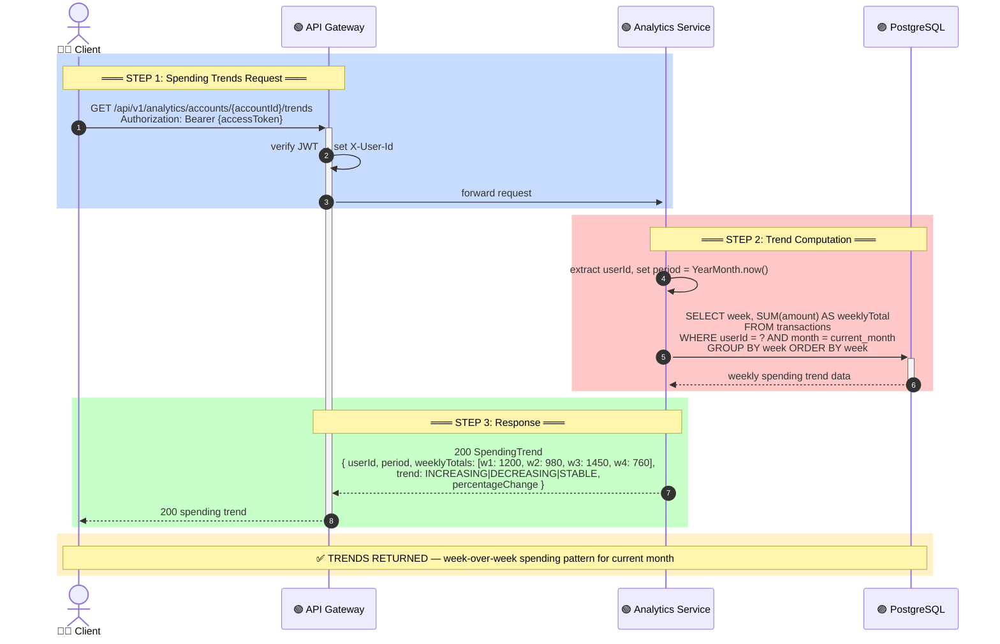

```mermaid
sequenceDiagram
    autonumber
    actor Client as 🧑‍💻 Client
    participant GW as 🟢 API Gateway
    participant AN as 🟢 Analytics Service
    participant PG as 🟣 PostgreSQL

    rect rgb(200, 220, 255)
        Note over Client,GW: ═══ STEP 1: Spending Trends Request ═══
        Client->>+GW: GET /api/v1/analytics/accounts/{accountId}/trends<br/>Authorization: Bearer {accessToken}
        GW->>GW: verify JWT → set X-User-Id
        GW->>+AN: forward request
    end

    rect rgb(255, 200, 200)
        Note over AN,PG: ═══ STEP 2: Trend Computation ═══
        AN->>AN: extract userId, set period = YearMonth.now()
        AN->>+PG: SELECT week, SUM(amount) AS weeklyTotal<br/>FROM transactions<br/>WHERE userId = ? AND month = current_month<br/>GROUP BY week ORDER BY week
        PG-->>-AN: weekly spending trend data
    end

    rect rgb(200, 255, 200)
        Note over AN,GW: ═══ STEP 3: Response ═══
        AN-->>GW: 200 SpendingTrend<br/>{ userId, period, weeklyTotals: [w1: 1200, w2: 980, w3: 1450, w4: 760],<br/>  trend: INCREASING|DECREASING|STABLE,<br/>  percentageChange }
        GW-->>-Client: 200 spending trend
    end

    rect rgb(255, 240, 200)
        Note over Client,PG: ✅ TRENDS RETURNED — week-over-week spending pattern for current month
    end
```
