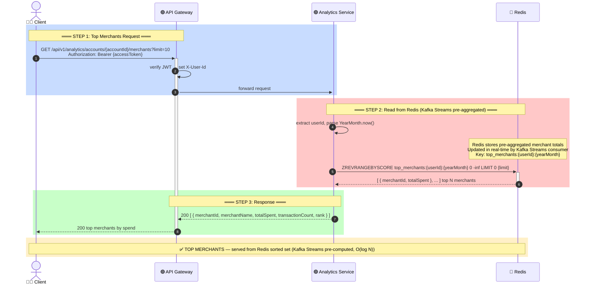

```mermaid
sequenceDiagram
    autonumber
    actor Client as 🧑‍💻 Client
    participant GW as 🟢 API Gateway
    participant AN as 🟢 Analytics Service
    participant RD as 🔴 Redis

    rect rgb(200, 220, 255)
        Note over Client,GW: ═══ STEP 1: Top Merchants Request ═══
        Client->>+GW: GET /api/v1/analytics/accounts/{accountId}/merchants?limit=10<br/>Authorization: Bearer {accessToken}
        GW->>GW: verify JWT → set X-User-Id
        GW->>+AN: forward request
    end

    rect rgb(255, 200, 200)
        Note over AN,RD: ═══ STEP 2: Read from Redis (Kafka Streams pre-aggregated) ═══
        AN->>AN: extract userId, parse YearMonth.now()
        Note over RD: Redis stores pre-aggregated merchant totals<br/>Updated in real-time by Kafka Streams consumer<br/>Key: top_merchants:{userId}:{yearMonth}
        AN->>+RD: ZREVRANGEBYSCORE top_merchants:{userId}:{yearMonth} 0 -inf LIMIT 0 {limit}
        RD-->>-AN: [ { merchantId, totalSpent }, ... ] top N merchants
    end

    rect rgb(200, 255, 200)
        Note over AN,GW: ═══ STEP 3: Response ═══
        AN-->>GW: 200 [ { merchantId, merchantName, totalSpent, transactionCount, rank } ]
        GW-->>-Client: 200 top merchants by spend
    end

    rect rgb(255, 240, 200)
        Note over Client,RD: ✅ TOP MERCHANTS — served from Redis sorted set (Kafka Streams pre-computed, O(log N))
    end
```
