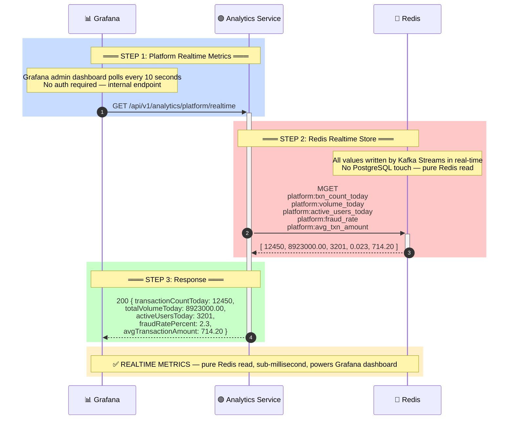

```mermaid
sequenceDiagram
    autonumber
    participant GRF as 📊 Grafana
    participant AN as 🟢 Analytics Service
    participant RD as 🔴 Redis

    rect rgb(200, 220, 255)
        Note over GRF,AN: ═══ STEP 1: Platform Realtime Metrics ═══
        Note over GRF: Grafana admin dashboard polls every 10 seconds<br/>No auth required — internal endpoint
        GRF->>+AN: GET /api/v1/analytics/platform/realtime
    end

    rect rgb(255, 200, 200)
        Note over AN,RD: ═══ STEP 2: Redis Realtime Store ═══
        Note over RD: All values written by Kafka Streams in real-time<br/>No PostgreSQL touch — pure Redis read
        AN->>+RD: MGET<br/>  platform:txn_count_today<br/>  platform:volume_today<br/>  platform:active_users_today<br/>  platform:fraud_rate<br/>  platform:avg_txn_amount
        RD-->>-AN: [ 12450, 8923000.00, 3201, 0.023, 714.20 ]
    end

    rect rgb(200, 255, 200)
        Note over AN,GRF: ═══ STEP 3: Response ═══
        AN-->>-GRF: 200 { transactionCountToday: 12450,<br/>  totalVolumeToday: 8923000.00,<br/>  activeUsersToday: 3201,<br/>  fraudRatePercent: 2.3,<br/>  avgTransactionAmount: 714.20 }
    end

    rect rgb(255, 240, 200)
        Note over GRF,RD: ✅ REALTIME METRICS — pure Redis read, sub-millisecond, powers Grafana dashboard
    end
```
