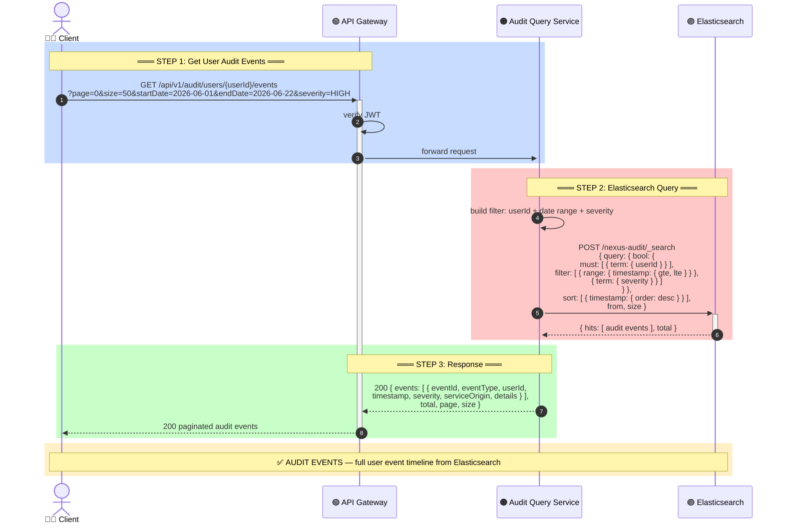

```mermaid
sequenceDiagram
    autonumber
    actor Client as 🧑‍💻 Client
    participant GW as 🟢 API Gateway
    participant AQ as 🟠 Audit Query Service
    participant ES as 🟣 Elasticsearch

    rect rgb(200, 220, 255)
        Note over Client,GW: ═══ STEP 1: Get User Audit Events ═══
        Client->>+GW: GET /api/v1/audit/users/{userId}/events<br/>?page=0&size=50&startDate=2026-06-01&endDate=2026-06-22&severity=HIGH
        GW->>GW: verify JWT
        GW->>+AQ: forward request
    end

    rect rgb(255, 200, 200)
        Note over AQ,ES: ═══ STEP 2: Elasticsearch Query ═══
        AQ->>AQ: build filter: userId + date range + severity
        AQ->>+ES: POST /nexus-audit/_search<br/>{ query: { bool: {<br/>    must: [ { term: { userId } } ],<br/>    filter: [ { range: { timestamp: { gte, lte } } },<br/>              { term: { severity } } ]<br/>  } },<br/>  sort: [ { timestamp: { order: desc } } ],<br/>  from, size }
        ES-->>-AQ: { hits: [ audit events ], total }
    end

    rect rgb(200, 255, 200)
        Note over AQ,GW: ═══ STEP 3: Response ═══
        AQ-->>GW: 200 { events: [ { eventId, eventType, userId,<br/>  timestamp, severity, serviceOrigin, details } ],<br/>  total, page, size }
        GW-->>-Client: 200 paginated audit events
    end

    rect rgb(255, 240, 200)
        Note over Client,ES: ✅ AUDIT EVENTS — full user event timeline from Elasticsearch
    end
```
