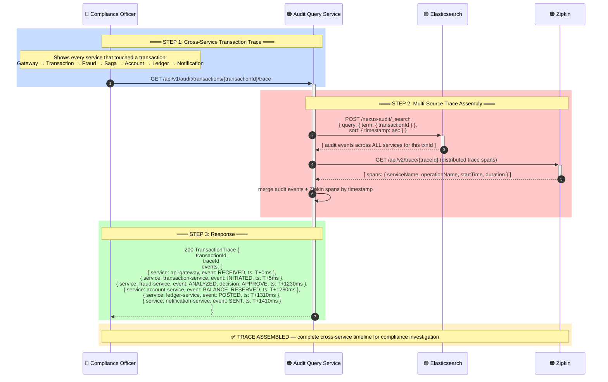

```mermaid
sequenceDiagram
    autonumber
    participant CO as 👮 Compliance Officer
    participant AQ as 🟠 Audit Query Service
    participant ES as 🟣 Elasticsearch
    participant ZP as 🟠 Zipkin

    rect rgb(200, 220, 255)
        Note over CO,AQ: ═══ STEP 1: Cross-Service Transaction Trace ═══
        Note over CO: Shows every service that touched a transaction:<br/>Gateway → Transaction → Fraud → Saga → Account → Ledger → Notification
        CO->>+AQ: GET /api/v1/audit/transactions/{transactionId}/trace
    end

    rect rgb(255, 200, 200)
        Note over AQ,ZP: ═══ STEP 2: Multi-Source Trace Assembly ═══
        AQ->>+ES: POST /nexus-audit/_search<br/>{ query: { term: { transactionId } },<br/>  sort: { timestamp: asc } }
        ES-->>-AQ: [ audit events across ALL services for this txnId ]
        AQ->>+ZP: GET /api/v2/trace/{traceId} (distributed trace spans)
        ZP-->>-AQ: [ spans: { serviceName, operationName, startTime, duration } ]
        AQ->>AQ: merge audit events + Zipkin spans by timestamp
    end

    rect rgb(200, 255, 200)
        Note over AQ,CO: ═══ STEP 3: Response ═══
        AQ-->>-CO: 200 TransactionTrace {<br/>  transactionId,<br/>  traceId,<br/>  events: [<br/>    { service: api-gateway, event: RECEIVED, ts: T+0ms },<br/>    { service: transaction-service, event: INITIATED, ts: T+5ms },<br/>    { service: fraud-service, event: ANALYZED, decision: APPROVE, ts: T+1230ms },<br/>    { service: account-service, event: BALANCE_RESERVED, ts: T+1280ms },<br/>    { service: ledger-service, event: POSTED, ts: T+1310ms },<br/>    { service: notification-service, event: SENT, ts: T+1410ms }<br/>  ]<br/>}
    end

    rect rgb(255, 240, 200)
        Note over CO,ZP: ✅ TRACE ASSEMBLED — complete cross-service timeline for compliance investigation
    end
```
