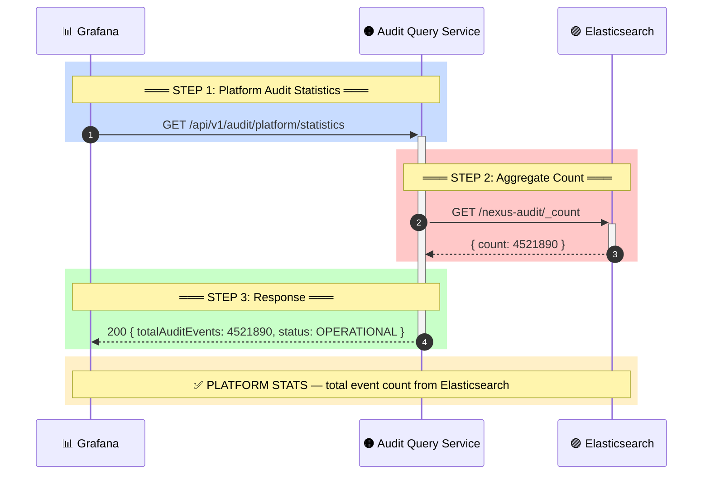

```mermaid
sequenceDiagram
    autonumber
    participant GRF as 📊 Grafana
    participant AQ as 🟠 Audit Query Service
    participant ES as 🟣 Elasticsearch

    rect rgb(200, 220, 255)
        Note over GRF,AQ: ═══ STEP 1: Platform Audit Statistics ═══
        GRF->>+AQ: GET /api/v1/audit/platform/statistics
    end

    rect rgb(255, 200, 200)
        Note over AQ,ES: ═══ STEP 2: Aggregate Count ═══
        AQ->>+ES: GET /nexus-audit/_count
        ES-->>-AQ: { count: 4521890 }
    end

    rect rgb(200, 255, 200)
        Note over AQ,GRF: ═══ STEP 3: Response ═══
        AQ-->>-GRF: 200 { totalAuditEvents: 4521890, status: OPERATIONAL }
    end

    rect rgb(255, 240, 200)
        Note over GRF,ES: ✅ PLATFORM STATS — total event count from Elasticsearch
    end
```
