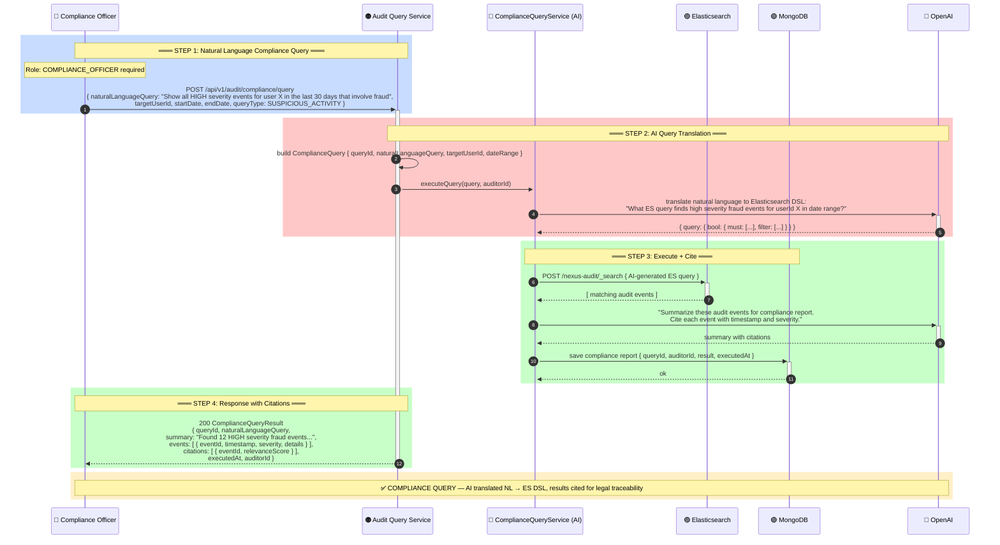

```mermaid
sequenceDiagram
    autonumber
    participant CO as 👮 Compliance Officer
    participant AQ as 🟠 Audit Query Service
    participant CQS as 🤖 ComplianceQueryService (AI)
    participant ES as 🟣 Elasticsearch
    participant MDB as 🟢 MongoDB
    participant LLM as 🧠 OpenAI

    rect rgb(200, 220, 255)
        Note over CO,AQ: ═══ STEP 1: Natural Language Compliance Query ═══
        Note over CO: Role: COMPLIANCE_OFFICER required
        CO->>+AQ: POST /api/v1/audit/compliance/query<br/>{ naturalLanguageQuery: "Show all HIGH severity events for user X in the last 30 days that involve fraud",<br/>  targetUserId, startDate, endDate, queryType: SUSPICIOUS_ACTIVITY }
    end

    rect rgb(255, 200, 200)
        Note over AQ,LLM: ═══ STEP 2: AI Query Translation ═══
        AQ->>AQ: build ComplianceQuery { queryId, naturalLanguageQuery, targetUserId, dateRange }
        AQ->>+CQS: executeQuery(query, auditorId)
        CQS->>+LLM: translate natural language to Elasticsearch DSL:<br/>"What ES query finds high severity fraud events for userId X in date range?"
        LLM-->>-CQS: { query: { bool: { must: [...], filter: [...] } } }
    end

    rect rgb(200, 255, 200)
        Note over CQS,MDB: ═══ STEP 3: Execute + Cite ═══
        CQS->>+ES: POST /nexus-audit/_search { AI-generated ES query }
        ES-->>-CQS: [ matching audit events ]
        CQS->>+LLM: "Summarize these audit events for compliance report.<br/>Cite each event with timestamp and severity."
        LLM-->>-CQS: summary with citations
        CQS->>+MDB: save compliance report { queryId, auditorId, result, executedAt }
        MDB-->>-CQS: ok
    end

    rect rgb(200, 255, 200)
        Note over AQ,CO: ═══ STEP 4: Response with Citations ═══
        AQ-->>-CO: 200 ComplianceQueryResult<br/>{ queryId, naturalLanguageQuery,<br/>  summary: "Found 12 HIGH severity fraud events...",<br/>  events: [ { eventId, timestamp, severity, details } ],<br/>  citations: [ { eventId, relevanceScore } ],<br/>  executedAt, auditorId }
    end

    rect rgb(255, 240, 200)
        Note over CO,LLM: ✅ COMPLIANCE QUERY — AI translated NL → ES DSL, results cited for legal traceability
    end
```
