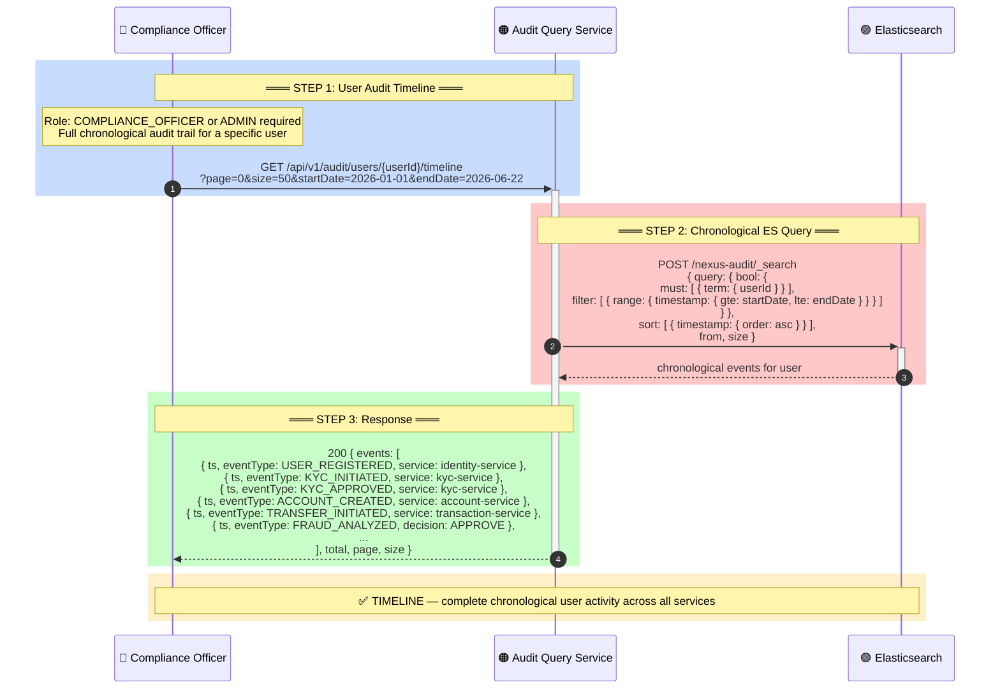

```mermaid
sequenceDiagram
    autonumber
    participant CO as 👮 Compliance Officer
    participant AQ as 🟠 Audit Query Service
    participant ES as 🟣 Elasticsearch

    rect rgb(200, 220, 255)
        Note over CO,AQ: ═══ STEP 1: User Audit Timeline ═══
        Note over CO: Role: COMPLIANCE_OFFICER or ADMIN required<br/>Full chronological audit trail for a specific user
        CO->>+AQ: GET /api/v1/audit/users/{userId}/timeline<br/>?page=0&size=50&startDate=2026-01-01&endDate=2026-06-22
    end

    rect rgb(255, 200, 200)
        Note over AQ,ES: ═══ STEP 2: Chronological ES Query ═══
        AQ->>+ES: POST /nexus-audit/_search<br/>{ query: { bool: {<br/>    must: [ { term: { userId } } ],<br/>    filter: [ { range: { timestamp: { gte: startDate, lte: endDate } } } ]<br/>  } },<br/>  sort: [ { timestamp: { order: asc } } ],<br/>  from, size }
        ES-->>-AQ: chronological events for user
    end

    rect rgb(200, 255, 200)
        Note over AQ,CO: ═══ STEP 3: Response ═══
        AQ-->>-CO: 200 { events: [<br/>  { ts, eventType: USER_REGISTERED, service: identity-service },<br/>  { ts, eventType: KYC_INITIATED, service: kyc-service },<br/>  { ts, eventType: KYC_APPROVED, service: kyc-service },<br/>  { ts, eventType: ACCOUNT_CREATED, service: account-service },<br/>  { ts, eventType: TRANSFER_INITIATED, service: transaction-service },<br/>  { ts, eventType: FRAUD_ANALYZED, decision: APPROVE },<br/>  ...<br/>], total, page, size }
    end

    rect rgb(255, 240, 200)
        Note over CO,ES: ✅ TIMELINE — complete chronological user activity across all services
    end
```
