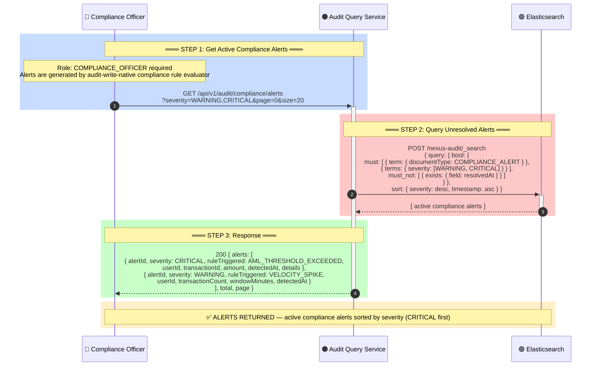

```mermaid
sequenceDiagram
    autonumber
    participant CO as 👮 Compliance Officer
    participant AQ as 🟠 Audit Query Service
    participant ES as 🟣 Elasticsearch

    rect rgb(200, 220, 255)
        Note over CO,AQ: ═══ STEP 1: Get Active Compliance Alerts ═══
        Note over CO: Role: COMPLIANCE_OFFICER required<br/>Alerts are generated by audit-write-native compliance rule evaluator
        CO->>+AQ: GET /api/v1/audit/compliance/alerts<br/>?severity=WARNING,CRITICAL&page=0&size=20
    end

    rect rgb(255, 200, 200)
        Note over AQ,ES: ═══ STEP 2: Query Unresolved Alerts ═══
        AQ->>+ES: POST /nexus-audit/_search<br/>{ query: { bool: {<br/>    must: [ { term: { documentType: COMPLIANCE_ALERT } },<br/>            { terms: { severity: [WARNING, CRITICAL] } } ],<br/>    must_not: [ { exists: { field: resolvedAt } } ]<br/>  } },<br/>  sort: { severity: desc, timestamp: asc } }
        ES-->>-AQ: [ active compliance alerts ]
    end

    rect rgb(200, 255, 200)
        Note over AQ,CO: ═══ STEP 3: Response ═══
        AQ-->>-CO: 200 { alerts: [<br/>  { alertId, severity: CRITICAL, ruleTriggered: AML_THRESHOLD_EXCEEDED,<br/>    userId, transactionId, amount, detectedAt, details },<br/>  { alertId, severity: WARNING, ruleTriggered: VELOCITY_SPIKE,<br/>    userId, transactionCount, windowMinutes, detectedAt }<br/>], total, page }
    end

    rect rgb(255, 240, 200)
        Note over CO,ES: ✅ ALERTS RETURNED — active compliance alerts sorted by severity (CRITICAL first)
    end
```
