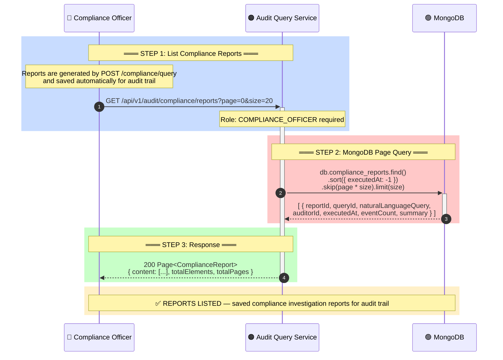

```mermaid
sequenceDiagram
    autonumber
    participant CO as 👮 Compliance Officer
    participant AQ as 🟠 Audit Query Service
    participant MDB as 🟢 MongoDB

    rect rgb(200, 220, 255)
        Note over CO,AQ: ═══ STEP 1: List Compliance Reports ═══
        Note over CO: Reports are generated by POST /compliance/query<br/>and saved automatically for audit trail
        CO->>+AQ: GET /api/v1/audit/compliance/reports?page=0&size=20
        Note over AQ: Role: COMPLIANCE_OFFICER required
    end

    rect rgb(255, 200, 200)
        Note over AQ,MDB: ═══ STEP 2: MongoDB Page Query ═══
        AQ->>+MDB: db.compliance_reports.find()<br/>.sort({ executedAt: -1 })<br/>.skip(page * size).limit(size)
        MDB-->>-AQ: [ { reportId, queryId, naturalLanguageQuery,<br/>  auditorId, executedAt, eventCount, summary } ]
    end

    rect rgb(200, 255, 200)
        Note over AQ,CO: ═══ STEP 3: Response ═══
        AQ-->>-CO: 200 Page<ComplianceReport><br/>{ content: [...], totalElements, totalPages }
    end

    rect rgb(255, 240, 200)
        Note over CO,MDB: ✅ REPORTS LISTED — saved compliance investigation reports for audit trail
    end
```
