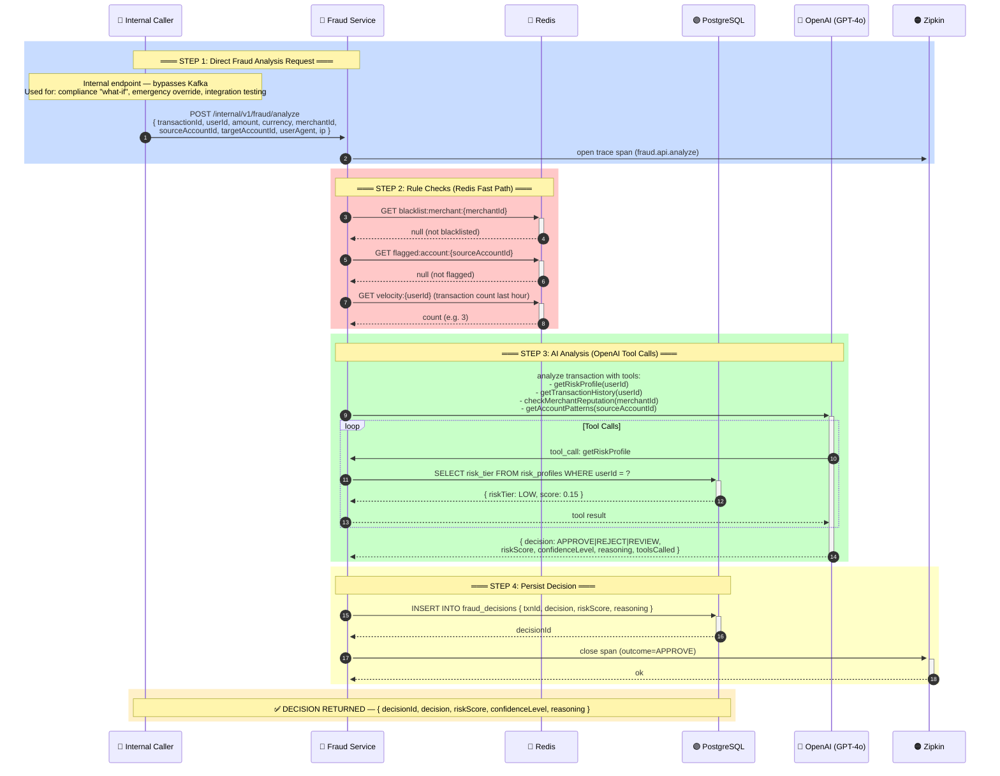

```mermaid
sequenceDiagram
    autonumber
    participant CALLER as 🔵 Internal Caller
    participant FR as 🔴 Fraud Service
    participant RD as 🔴 Redis
    participant PG as 🟣 PostgreSQL
    participant LLM as 🧠 OpenAI (GPT-4o)
    participant ZP as 🟠 Zipkin

    rect rgb(200, 220, 255)
        Note over CALLER,FR: ═══ STEP 1: Direct Fraud Analysis Request ═══
        Note over CALLER: Internal endpoint — bypasses Kafka<br/>Used for: compliance "what-if", emergency override, integration testing
        CALLER->>+FR: POST /internal/v1/fraud/analyze<br/>{ transactionId, userId, amount, currency, merchantId,<br/>  sourceAccountId, targetAccountId, userAgent, ip }
        FR->>+ZP: open trace span (fraud.api.analyze)
    end

    rect rgb(255, 200, 200)
        Note over FR,RD: ═══ STEP 2: Rule Checks (Redis Fast Path) ═══
        FR->>+RD: GET blacklist:merchant:{merchantId}
        RD-->>-FR: null (not blacklisted)
        FR->>+RD: GET flagged:account:{sourceAccountId}
        RD-->>-FR: null (not flagged)
        FR->>+RD: GET velocity:{userId} (transaction count last hour)
        RD-->>-FR: count (e.g. 3)
    end

    rect rgb(200, 255, 200)
        Note over FR,LLM: ═══ STEP 3: AI Analysis (OpenAI Tool Calls) ═══
        FR->>+LLM: analyze transaction with tools:<br/>- getRiskProfile(userId)<br/>- getTransactionHistory(userId)<br/>- checkMerchantReputation(merchantId)<br/>- getAccountPatterns(sourceAccountId)
        loop Tool Calls
            LLM->>FR: tool_call: getRiskProfile
            FR->>+PG: SELECT risk_tier FROM risk_profiles WHERE userId = ?
            PG-->>-FR: { riskTier: LOW, score: 0.15 }
            FR-->>LLM: tool result
        end
        LLM-->>-FR: { decision: APPROVE|REJECT|REVIEW,<br/>  riskScore, confidenceLevel, reasoning, toolsCalled }
    end

    rect rgb(255, 255, 200)
        Note over FR,PG: ═══ STEP 4: Persist Decision ═══
        FR->>+PG: INSERT INTO fraud_decisions { txnId, decision, riskScore, reasoning }
        PG-->>-FR: decisionId
        FR->>+ZP: close span (outcome=APPROVE)
        ZP-->>-FR: ok
    end

    rect rgb(255, 240, 200)
        Note over CALLER,PG: ✅ DECISION RETURNED — { decisionId, decision, riskScore, confidenceLevel, reasoning }
    end
```
