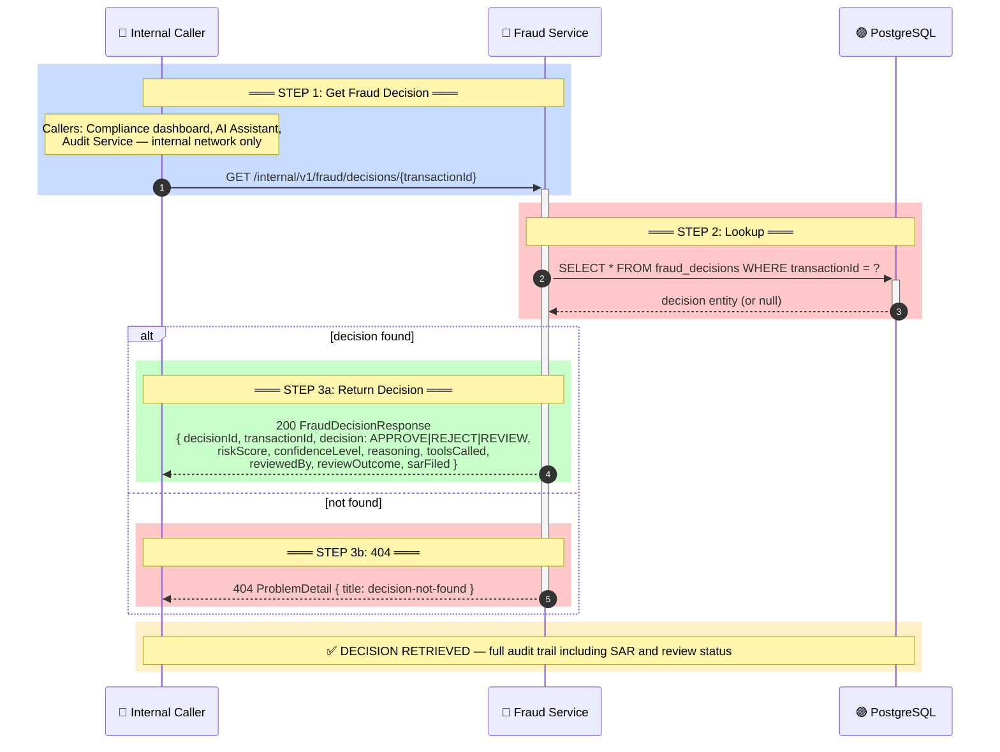

```mermaid
sequenceDiagram
    autonumber
    participant CALLER as 🔵 Internal Caller
    participant FR as 🔴 Fraud Service
    participant PG as 🟣 PostgreSQL

    rect rgb(200, 220, 255)
        Note over CALLER,FR: ═══ STEP 1: Get Fraud Decision ═══
        Note over CALLER: Callers: Compliance dashboard, AI Assistant,<br/>Audit Service — internal network only
        CALLER->>+FR: GET /internal/v1/fraud/decisions/{transactionId}
    end

    rect rgb(255, 200, 200)
        Note over FR,PG: ═══ STEP 2: Lookup ═══
        FR->>+PG: SELECT * FROM fraud_decisions WHERE transactionId = ?
        PG-->>-FR: decision entity (or null)
    end

    alt decision found
        rect rgb(200, 255, 200)
            Note over FR,CALLER: ═══ STEP 3a: Return Decision ═══
            FR-->>CALLER: 200 FraudDecisionResponse<br/>{ decisionId, transactionId, decision: APPROVE|REJECT|REVIEW,<br/>  riskScore, confidenceLevel, reasoning, toolsCalled,<br/>  reviewedBy, reviewOutcome, sarFiled }
        end
    else not found
        rect rgb(255, 200, 200)
            Note over FR,CALLER: ═══ STEP 3b: 404 ═══
            FR-->>-CALLER: 404 ProblemDetail { title: decision-not-found }
        end
    end

    rect rgb(255, 240, 200)
        Note over CALLER,PG: ✅ DECISION RETRIEVED — full audit trail including SAR and review status
    end
```
