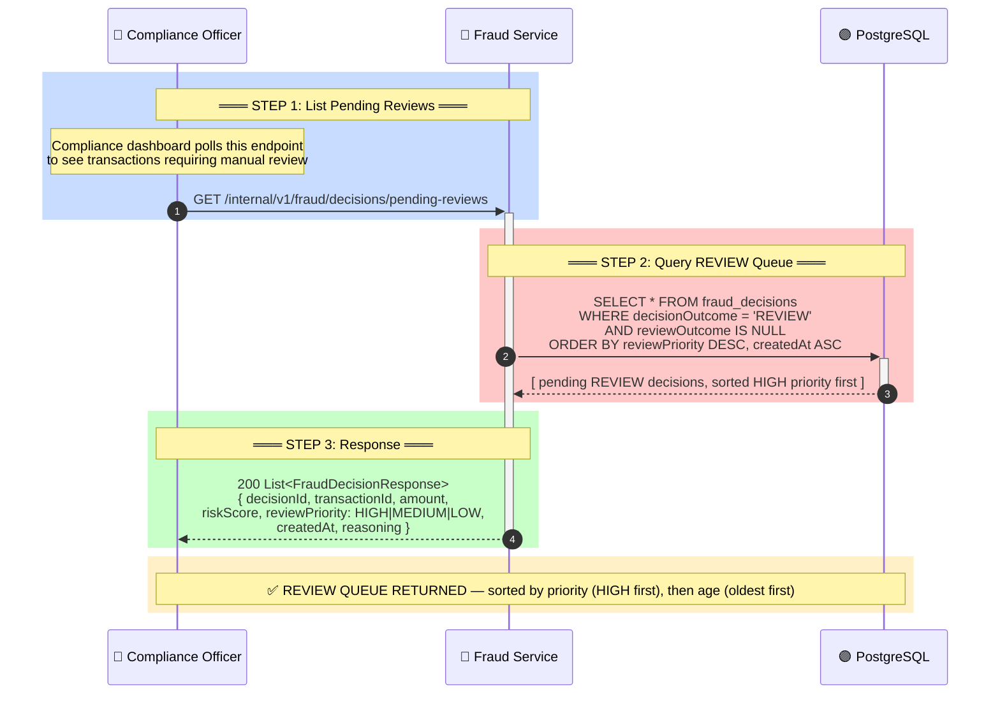

```mermaid
sequenceDiagram
    autonumber
    participant CO as 👮 Compliance Officer
    participant FR as 🔴 Fraud Service
    participant PG as 🟣 PostgreSQL

    rect rgb(200, 220, 255)
        Note over CO,FR: ═══ STEP 1: List Pending Reviews ═══
        Note over CO: Compliance dashboard polls this endpoint<br/>to see transactions requiring manual review
        CO->>+FR: GET /internal/v1/fraud/decisions/pending-reviews
    end

    rect rgb(255, 200, 200)
        Note over FR,PG: ═══ STEP 2: Query REVIEW Queue ═══
        FR->>+PG: SELECT * FROM fraud_decisions<br/>WHERE decisionOutcome = 'REVIEW'<br/>AND reviewOutcome IS NULL<br/>ORDER BY reviewPriority DESC, createdAt ASC
        PG-->>-FR: [ pending REVIEW decisions, sorted HIGH priority first ]
    end

    rect rgb(200, 255, 200)
        Note over FR,CO: ═══ STEP 3: Response ═══
        FR-->>-CO: 200 List<FraudDecisionResponse><br/>{ decisionId, transactionId, amount,<br/>  riskScore, reviewPriority: HIGH|MEDIUM|LOW,<br/>  createdAt, reasoning }
    end

    rect rgb(255, 240, 200)
        Note over CO,PG: ✅ REVIEW QUEUE RETURNED — sorted by priority (HIGH first), then age (oldest first)
    end
```
