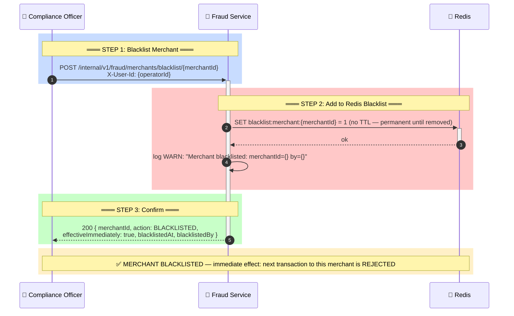

```mermaid
sequenceDiagram
    autonumber
    participant CO as 👮 Compliance Officer
    participant FR as 🔴 Fraud Service
    participant RD as 🔴 Redis

    rect rgb(200, 220, 255)
        Note over CO,FR: ═══ STEP 1: Blacklist Merchant ═══
        CO->>+FR: POST /internal/v1/fraud/merchants/blacklist/{merchantId}<br/>X-User-Id: {operatorId}
    end

    rect rgb(255, 200, 200)
        Note over FR,RD: ═══ STEP 2: Add to Redis Blacklist ═══
        FR->>+RD: SET blacklist:merchant:{merchantId} = 1 (no TTL — permanent until removed)
        RD-->>-FR: ok
        FR->>FR: log WARN: "Merchant blacklisted: merchantId={} by={}"
    end

    rect rgb(200, 255, 200)
        Note over FR,CO: ═══ STEP 3: Confirm ═══
        FR-->>-CO: 200 { merchantId, action: BLACKLISTED,<br/>  effectiveImmediately: true, blacklistedAt, blacklistedBy }
    end

    rect rgb(255, 240, 200)
        Note over CO,RD: ✅ MERCHANT BLACKLISTED — immediate effect: next transaction to this merchant is REJECTED
    end
```
