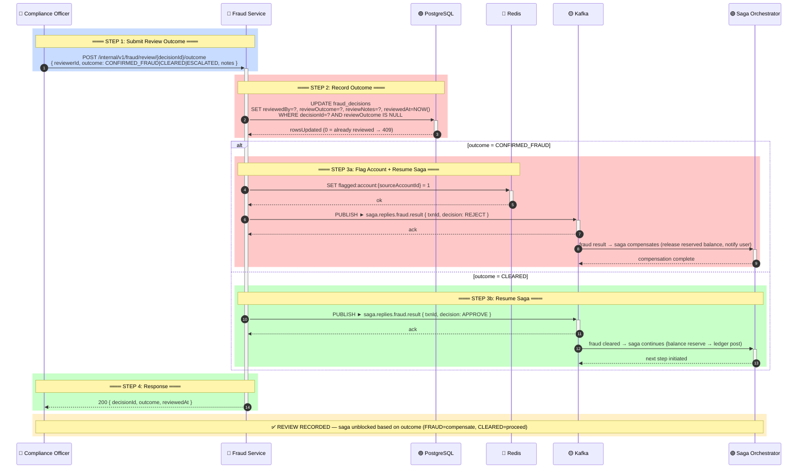

```mermaid
sequenceDiagram
    autonumber
    participant CO as 👮 Compliance Officer
    participant FR as 🔴 Fraud Service
    participant PG as 🟣 PostgreSQL
    participant RD as 🔴 Redis
    participant K as 🟡 Kafka
    participant SO as 🟢 Saga Orchestrator

    rect rgb(200, 220, 255)
        Note over CO,FR: ═══ STEP 1: Submit Review Outcome ═══
        CO->>+FR: POST /internal/v1/fraud/review/{decisionId}/outcome<br/>{ reviewerId, outcome: CONFIRMED_FRAUD|CLEARED|ESCALATED, notes }
    end

    rect rgb(255, 200, 200)
        Note over FR,PG: ═══ STEP 2: Record Outcome ═══
        FR->>+PG: UPDATE fraud_decisions<br/>SET reviewedBy=?, reviewOutcome=?, reviewNotes=?, reviewedAt=NOW()<br/>WHERE decisionId=? AND reviewOutcome IS NULL
        PG-->>-FR: rowsUpdated (0 = already reviewed → 409)
    end

    alt outcome = CONFIRMED_FRAUD
        rect rgb(255, 200, 200)
            Note over FR,RD: ═══ STEP 3a: Flag Account + Resume Saga ═══
            FR->>+RD: SET flagged:account:{sourceAccountId} = 1
            RD-->>-FR: ok
            FR->>+K: PUBLISH ► saga.replies.fraud.result { txnId, decision: REJECT }
            K-->>-FR: ack
            K->>+SO: fraud result → saga compensates (release reserved balance, notify user)
            SO-->>-K: compensation complete
        end
    else outcome = CLEARED
        rect rgb(200, 255, 200)
            Note over FR,SO: ═══ STEP 3b: Resume Saga ═══
            FR->>+K: PUBLISH ► saga.replies.fraud.result { txnId, decision: APPROVE }
            K-->>-FR: ack
            K->>+SO: fraud cleared → saga continues (balance reserve → ledger post)
            SO-->>-K: next step initiated
        end
    end

    rect rgb(200, 255, 200)
        Note over FR,CO: ═══ STEP 4: Response ═══
        FR-->>-CO: 200 { decisionId, outcome, reviewedAt }
    end

    rect rgb(255, 240, 200)
        Note over CO,SO: ✅ REVIEW RECORDED — saga unblocked based on outcome (FRAUD=compensate, CLEARED=proceed)
    end
```
