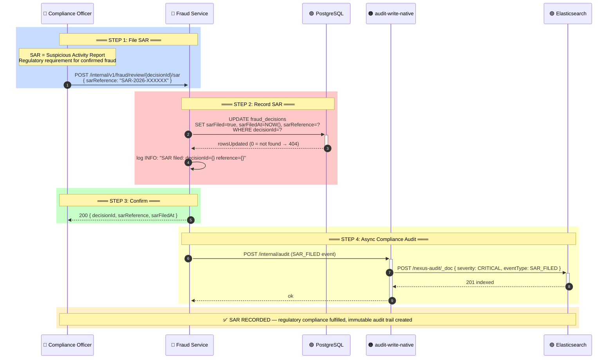

```mermaid
sequenceDiagram
    autonumber
    participant CO as 👮 Compliance Officer
    participant FR as 🔴 Fraud Service
    participant PG as 🟣 PostgreSQL
    participant AUD as 🟠 audit-write-native
    participant ES as 🟣 Elasticsearch

    rect rgb(200, 220, 255)
        Note over CO,FR: ═══ STEP 1: File SAR ═══
        Note over CO: SAR = Suspicious Activity Report<br/>Regulatory requirement for confirmed fraud
        CO->>+FR: POST /internal/v1/fraud/review/{decisionId}/sar<br/>{ sarReference: "SAR-2026-XXXXXX" }
    end

    rect rgb(255, 200, 200)
        Note over FR,PG: ═══ STEP 2: Record SAR ═══
        FR->>+PG: UPDATE fraud_decisions<br/>SET sarFiled=true, sarFiledAt=NOW(), sarReference=?<br/>WHERE decisionId=?
        PG-->>-FR: rowsUpdated (0 = not found → 404)
        FR->>FR: log INFO: "SAR filed: decisionId={} reference={}"
    end

    rect rgb(200, 255, 200)
        Note over FR,CO: ═══ STEP 3: Confirm ═══
        FR-->>CO: 200 { decisionId, sarReference, sarFiledAt }
    end

    rect rgb(255, 255, 200)
        Note over FR,ES: ═══ STEP 4: Async Compliance Audit ═══
        FR->>+AUD: POST /internal/audit (SAR_FILED event)
        AUD->>+ES: POST /nexus-audit/_doc { severity: CRITICAL, eventType: SAR_FILED }
        ES-->>-AUD: 201 indexed
        AUD-->>-FR: ok
    end

    rect rgb(255, 240, 200)
        Note over CO,ES: ✅ SAR RECORDED — regulatory compliance fulfilled, immutable audit trail created
    end
```
