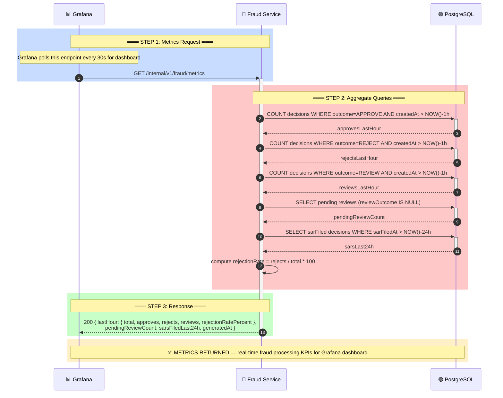

```mermaid
sequenceDiagram
    autonumber
    participant GRF as 📊 Grafana
    participant FR as 🔴 Fraud Service
    participant PG as 🟣 PostgreSQL

    rect rgb(200, 220, 255)
        Note over GRF,FR: ═══ STEP 1: Metrics Request ═══
        Note over GRF: Grafana polls this endpoint every 30s for dashboard
        GRF->>+FR: GET /internal/v1/fraud/metrics
    end

    rect rgb(255, 200, 200)
        Note over FR,PG: ═══ STEP 2: Aggregate Queries ═══
        FR->>+PG: COUNT decisions WHERE outcome=APPROVE AND createdAt > NOW()-1h
        PG-->>-FR: approvesLastHour
        FR->>+PG: COUNT decisions WHERE outcome=REJECT AND createdAt > NOW()-1h
        PG-->>-FR: rejectsLastHour
        FR->>+PG: COUNT decisions WHERE outcome=REVIEW AND createdAt > NOW()-1h
        PG-->>-FR: reviewsLastHour
        FR->>+PG: SELECT pending reviews (reviewOutcome IS NULL)
        PG-->>-FR: pendingReviewCount
        FR->>+PG: SELECT sarFiled decisions WHERE sarFiledAt > NOW()-24h
        PG-->>-FR: sarsLast24h
        FR->>FR: compute rejectionRate = rejects / total * 100
    end

    rect rgb(200, 255, 200)
        Note over FR,GRF: ═══ STEP 3: Response ═══
        FR-->>-GRF: 200 { lastHour: { total, approves, rejects, reviews, rejectionRatePercent },<br/>  pendingReviewCount, sarsFiledLast24h, generatedAt }
    end

    rect rgb(255, 240, 200)
        Note over GRF,PG: ✅ METRICS RETURNED — real-time fraud processing KPIs for Grafana dashboard
    end
```
