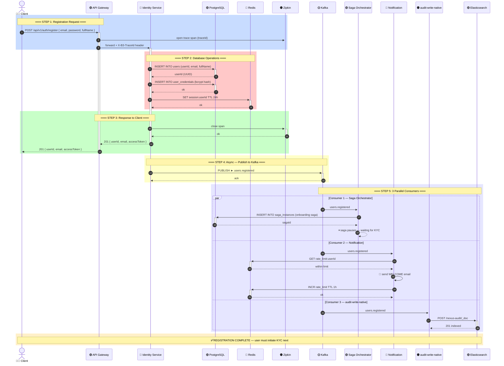

```mermaid
sequenceDiagram
    autonumber
    actor Client as 🧑‍💻 Client
    participant GW as 🟢 API Gateway
    participant ID as 🔵 Identity Service
    participant PG as 🟣 PostgreSQL
    participant RD as 🔴 Redis
    participant ZP as 🟠 Zipkin
    participant K as 🟡 Kafka
    participant SO as 🟢 Saga Orchestrator
    participant NOT as 🔵 Notification
    participant AUD as 🟠 audit-write-native
    participant ES as 🟣 Elasticsearch

    rect rgb(200, 220, 255)
        Note over Client,GW: ═══ STEP 1: Registration Request ═══
        Client->>+GW: POST /api/v1/auth/register { email, password, fullName }
        GW->>+ZP: open trace span (traceId)
        GW->>+ID: forward + X-B3-TraceId header
    end

    rect rgb(255, 200, 200)
        Note over ID,RD: ═══ STEP 2: Database Operations ═══
        ID->>+PG: INSERT INTO users (userId, email, fullName)
        PG-->>-ID: userId (UUID)
        ID->>+PG: INSERT INTO user_credentials (bcrypt hash)
        PG-->>-ID: ok
        ID->>+RD: SET session:userId TTL 24h
        RD-->>-ID: ok
    end

    rect rgb(200, 255, 200)
        Note over ID,GW: ═══ STEP 3: Response to Client ═══
        ID->>+ZP: close span
        ZP-->>-ID: ok
        ID-->>-GW: 201 { userId, email, accessToken }
        GW-->>-Client: 201 { userId, email, accessToken }
    end

    rect rgb(255, 255, 200)
        Note over ID,K: ═══ STEP 4: Async — Publish to Kafka ═══
        ID->>+K: PUBLISH ► users.registered
        K-->>-ID: ack
    end

    rect rgb(230, 230, 255)
        Note over K,ES: ═══ STEP 5: 3 Parallel Consumers ═══
        par Consumer 1 — Saga Orchestrator
            K->>+SO: users.registered
            SO->>+PG: INSERT INTO saga_instances (onboarding saga)
            PG-->>-SO: sagaId
            SO-->>SO: ⏸ saga pauses — waiting for KYC
        and Consumer 2 — Notification
            K->>+NOT: users.registered
            NOT->>+RD: GET rate_limit:userId
            RD-->>-NOT: within limit
            NOT->>NOT: 📧 send WELCOME email
            NOT->>+RD: INCR rate_limit TTL 1h
            RD-->>-NOT: ok
        and Consumer 3 — audit-write-native
            K->>+AUD: users.registered
            AUD->>+ES: POST /nexus-audit/_doc
            ES-->>-AUD: 201 indexed
        end
    end

    rect rgb(255, 240, 200)
        Note over Client,ES: ✅ REGISTRATION COMPLETE — user must initiate KYC next
    end
```
