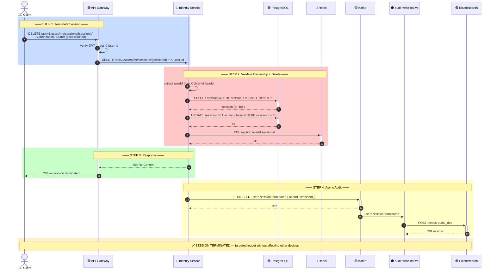

```mermaid
sequenceDiagram
    autonumber
    actor Client as 🧑‍💻 Client
    participant GW as 🟢 API Gateway
    participant ID as 🔵 Identity Service
    participant PG as 🟣 PostgreSQL
    participant RD as 🔴 Redis
    participant K as 🟡 Kafka
    participant AUD as 🟠 audit-write-native
    participant ES as 🟣 Elasticsearch

    rect rgb(200, 220, 255)
        Note over Client,GW: ═══ STEP 1: Terminate Session ═══
        Client->>+GW: DELETE /api/v1/users/me/sessions/{sessionId}<br/>Authorization: Bearer {accessToken}
        GW->>GW: verify JWT → set X-User-Id
        GW->>+ID: DELETE /api/v1/users/me/sessions/{sessionId} + X-User-Id
    end

    rect rgb(255, 200, 200)
        Note over ID,RD: ═══ STEP 2: Validate Ownership + Delete ═══
        ID->>ID: extract userId from X-User-Id header
        ID->>+PG: SELECT session WHERE sessionId = ? AND userId = ?
        PG-->>-ID: session (or 404)
        ID->>+PG: UPDATE sessions SET active = false WHERE sessionId = ?
        PG-->>-ID: ok
        ID->>+RD: DEL session:userId:sessionId
        RD-->>-ID: ok
    end

    rect rgb(200, 255, 200)
        Note over ID,GW: ═══ STEP 3: Response ═══
        ID-->>GW: 204 No Content
        GW-->>-Client: 204 — session terminated
    end

    rect rgb(255, 255, 200)
        Note over ID,ES: ═══ STEP 4: Async Audit ═══
        ID->>+K: PUBLISH ► users.session.terminated { userId, sessionId }
        K-->>-ID: ack
        K->>+AUD: users.session.terminated
        AUD->>+ES: POST /nexus-audit/_doc
        ES-->>-AUD: 201 indexed
    end

    rect rgb(255, 240, 200)
        Note over Client,ES: ✅ SESSION TERMINATED — targeted logout without affecting other devices
    end
```
