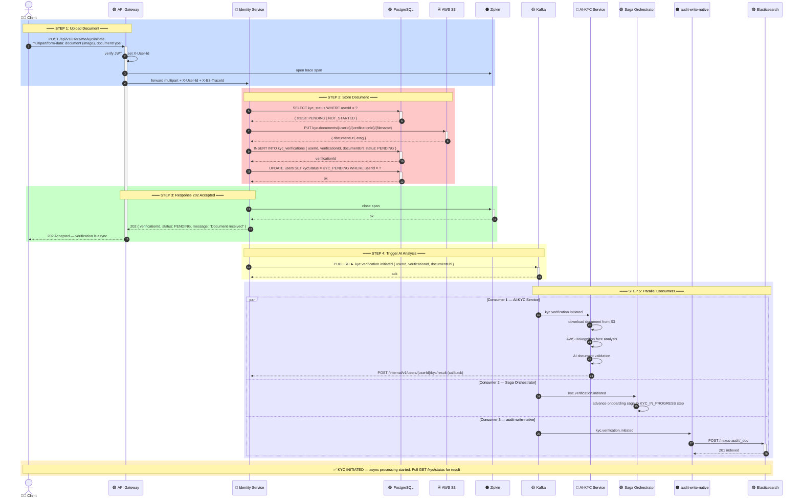

```mermaid
sequenceDiagram
    autonumber
    actor Client as 🧑‍💻 Client
    participant GW as 🟢 API Gateway
    participant ID as 🔵 Identity Service
    participant PG as 🟣 PostgreSQL
    participant S3 as 🗄️ AWS S3
    participant ZP as 🟠 Zipkin
    participant K as 🟡 Kafka
    participant KYC as 🔵 AI-KYC Service
    participant SO as 🟢 Saga Orchestrator
    participant AUD as 🟠 audit-write-native
    participant ES as 🟣 Elasticsearch

    rect rgb(200, 220, 255)
        Note over Client,GW: ═══ STEP 1: Upload Document ═══
        Client->>+GW: POST /api/v1/users/me/kyc/initiate<br/>multipart/form-data: document (image), documentType
        GW->>GW: verify JWT → set X-User-Id
        GW->>+ZP: open trace span
        GW->>+ID: forward multipart + X-User-Id + X-B3-TraceId
    end

    rect rgb(255, 200, 200)
        Note over ID,S3: ═══ STEP 2: Store Document ═══
        ID->>+PG: SELECT kyc_status WHERE userId = ?
        PG-->>-ID: { status: PENDING | NOT_STARTED }
        ID->>+S3: PUT kyc-documents/{userId}/{verificationId}/{filename}
        S3-->>-ID: { documentUrl, etag }
        ID->>+PG: INSERT INTO kyc_verifications { userId, verificationId, documentUrl, status: PENDING }
        PG-->>-ID: verificationId
        ID->>+PG: UPDATE users SET kycStatus = KYC_PENDING WHERE userId = ?
        PG-->>-ID: ok
    end

    rect rgb(200, 255, 200)
        Note over ID,GW: ═══ STEP 3: Response 202 Accepted ═══
        ID->>+ZP: close span
        ZP-->>-ID: ok
        ID-->>GW: 202 { verificationId, status: PENDING, message: "Document received" }
        GW-->>-Client: 202 Accepted — verification is async
    end

    rect rgb(255, 255, 200)
        Note over ID,K: ═══ STEP 4: Trigger AI Analysis ═══
        ID->>+K: PUBLISH ► kyc.verification.initiated { userId, verificationId, documentUrl }
        K-->>-ID: ack
    end

    rect rgb(230, 230, 255)
        Note over K,ES: ═══ STEP 5: Parallel Consumers ═══
        par Consumer 1 — AI-KYC Service
            K->>+KYC: kyc.verification.initiated
            KYC->>KYC: download document from S3
            KYC->>KYC: AWS Rekognition face analysis
            KYC->>KYC: AI document validation
            KYC-->>ID: POST /internal/v1/users/{userId}/kyc/result (callback)
        and Consumer 2 — Saga Orchestrator
            K->>+SO: kyc.verification.initiated
            SO->>SO: advance onboarding saga to KYC_IN_PROGRESS step
        and Consumer 3 — audit-write-native
            K->>+AUD: kyc.verification.initiated
            AUD->>+ES: POST /nexus-audit/_doc
            ES-->>-AUD: 201 indexed
        end
    end

    rect rgb(255, 240, 200)
        Note over Client,ES: ✅ KYC INITIATED — async processing started. Poll GET /kyc/status for result
    end
```
