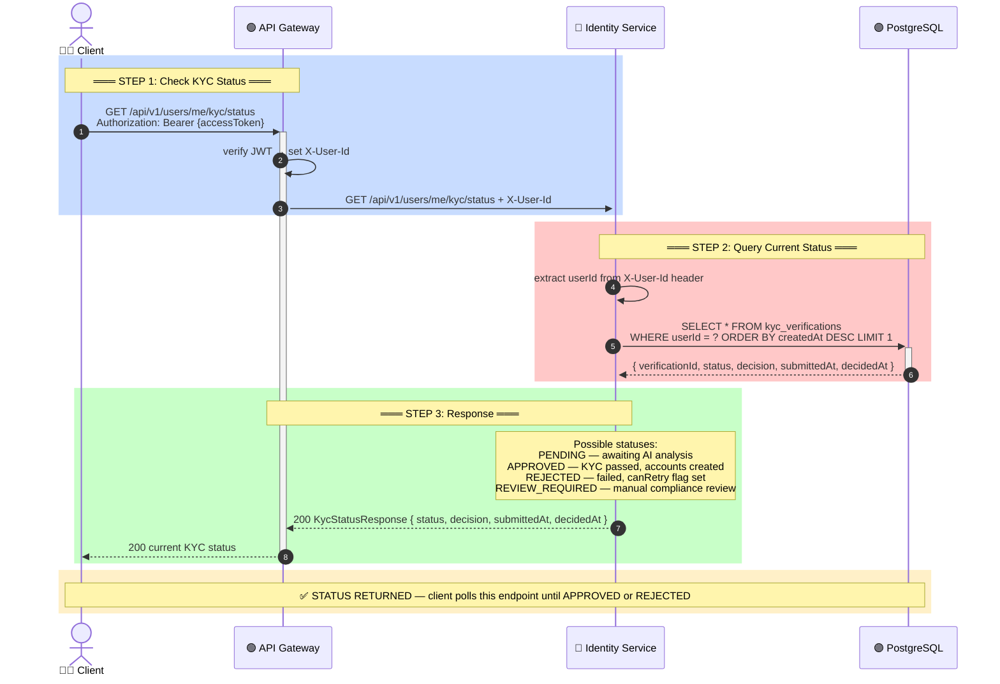

```mermaid
sequenceDiagram
    autonumber
    actor Client as 🧑‍💻 Client
    participant GW as 🟢 API Gateway
    participant ID as 🔵 Identity Service
    participant PG as 🟣 PostgreSQL

    rect rgb(200, 220, 255)
        Note over Client,GW: ═══ STEP 1: Check KYC Status ═══
        Client->>+GW: GET /api/v1/users/me/kyc/status<br/>Authorization: Bearer {accessToken}
        GW->>GW: verify JWT → set X-User-Id
        GW->>+ID: GET /api/v1/users/me/kyc/status + X-User-Id
    end

    rect rgb(255, 200, 200)
        Note over ID,PG: ═══ STEP 2: Query Current Status ═══
        ID->>ID: extract userId from X-User-Id header
        ID->>+PG: SELECT * FROM kyc_verifications<br/>WHERE userId = ? ORDER BY createdAt DESC LIMIT 1
        PG-->>-ID: { verificationId, status, decision, submittedAt, decidedAt }
    end

    rect rgb(200, 255, 200)
        Note over ID,GW: ═══ STEP 3: Response ═══
        Note over ID: Possible statuses:<br/>PENDING — awaiting AI analysis<br/>APPROVED — KYC passed, accounts created<br/>REJECTED — failed, canRetry flag set<br/>REVIEW_REQUIRED — manual compliance review
        ID-->>GW: 200 KycStatusResponse { status, decision, submittedAt, decidedAt }
        GW-->>-Client: 200 current KYC status
    end

    rect rgb(255, 240, 200)
        Note over Client,PG: ✅ STATUS RETURNED — client polls this endpoint until APPROVED or REJECTED
    end
```
