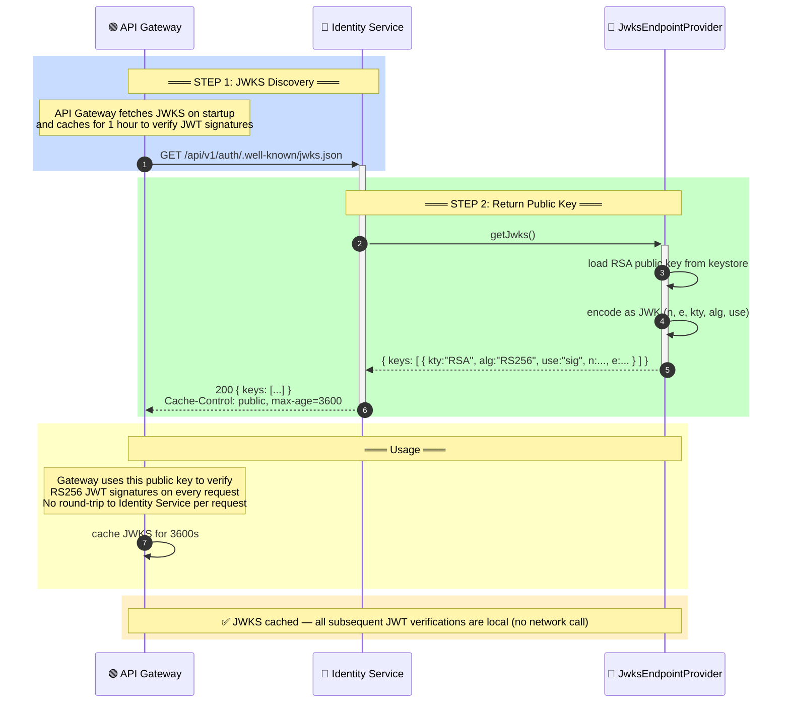

```mermaid
sequenceDiagram
    autonumber
    participant GW as 🟢 API Gateway
    participant ID as 🔵 Identity Service
    participant JWKS as 🔑 JwksEndpointProvider

    rect rgb(200, 220, 255)
        Note over GW,ID: ═══ STEP 1: JWKS Discovery ═══
        Note over GW: API Gateway fetches JWKS on startup<br/>and caches for 1 hour to verify JWT signatures
        GW->>+ID: GET /api/v1/auth/.well-known/jwks.json
    end

    rect rgb(200, 255, 200)
        Note over ID,JWKS: ═══ STEP 2: Return Public Key ═══
        ID->>+JWKS: getJwks()
        JWKS->>JWKS: load RSA public key from keystore
        JWKS->>JWKS: encode as JWK (n, e, kty, alg, use)
        JWKS-->>-ID: { keys: [ { kty:"RSA", alg:"RS256", use:"sig", n:..., e:... } ] }
        ID-->>-GW: 200 { keys: [...] }<br/>Cache-Control: public, max-age=3600
    end

    rect rgb(255, 255, 200)
        Note over GW,JWKS: ═══ Usage ═══
        Note over GW: Gateway uses this public key to verify<br/>RS256 JWT signatures on every request<br/>No round-trip to Identity Service per request
        GW->>GW: cache JWKS for 3600s
    end

    rect rgb(255, 240, 200)
        Note over GW,JWKS: ✅ JWKS cached — all subsequent JWT verifications are local (no network call)
    end
```
