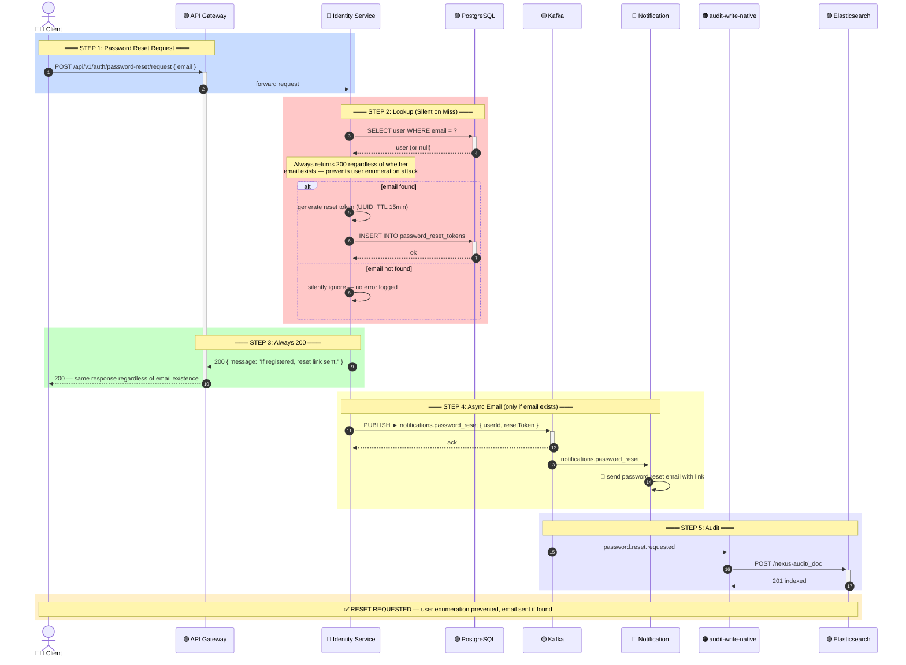

```mermaid
sequenceDiagram
    autonumber
    actor Client as 🧑‍💻 Client
    participant GW as 🟢 API Gateway
    participant ID as 🔵 Identity Service
    participant PG as 🟣 PostgreSQL
    participant K as 🟡 Kafka
    participant NOT as 🔵 Notification
    participant AUD as 🟠 audit-write-native
    participant ES as 🟣 Elasticsearch

    rect rgb(200, 220, 255)
        Note over Client,GW: ═══ STEP 1: Password Reset Request ═══
        Client->>+GW: POST /api/v1/auth/password-reset/request { email }
        GW->>+ID: forward request
    end

    rect rgb(255, 200, 200)
        Note over ID,PG: ═══ STEP 2: Lookup (Silent on Miss) ═══
        ID->>+PG: SELECT user WHERE email = ?
        PG-->>-ID: user (or null)
        Note over ID: Always returns 200 regardless of whether<br/>email exists — prevents user enumeration attack
        alt email found
            ID->>ID: generate reset token (UUID, TTL 15min)
            ID->>+PG: INSERT INTO password_reset_tokens
            PG-->>-ID: ok
        else email not found
            ID->>ID: silently ignore — no error logged
        end
    end

    rect rgb(200, 255, 200)
        Note over ID,GW: ═══ STEP 3: Always 200 ═══
        ID-->>GW: 200 { message: "If registered, reset link sent." }
        GW-->>-Client: 200 — same response regardless of email existence
    end

    rect rgb(255, 255, 200)
        Note over ID,NOT: ═══ STEP 4: Async Email (only if email exists) ═══
        ID->>+K: PUBLISH ► notifications.password_reset { userId, resetToken }
        K-->>-ID: ack
        K->>+NOT: notifications.password_reset
        NOT->>NOT: 📧 send password reset email with link
    end

    rect rgb(230, 230, 255)
        Note over K,ES: ═══ STEP 5: Audit ═══
        K->>+AUD: password.reset.requested
        AUD->>+ES: POST /nexus-audit/_doc
        ES-->>-AUD: 201 indexed
    end

    rect rgb(255, 240, 200)
        Note over Client,ES: ✅ RESET REQUESTED — user enumeration prevented, email sent if found
    end
```
