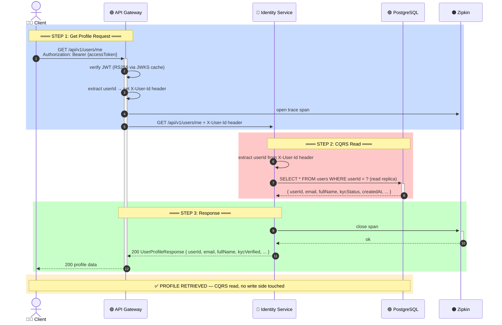

```mermaid
sequenceDiagram
    autonumber
    actor Client as 🧑‍💻 Client
    participant GW as 🟢 API Gateway
    participant ID as 🔵 Identity Service
    participant PG as 🟣 PostgreSQL
    participant ZP as 🟠 Zipkin

    rect rgb(200, 220, 255)
        Note over Client,GW: ═══ STEP 1: Get Profile Request ═══
        Client->>+GW: GET /api/v1/users/me<br/>Authorization: Bearer {accessToken}
        GW->>GW: verify JWT (RS256 via JWKS cache)
        GW->>GW: extract userId → set X-User-Id header
        GW->>+ZP: open trace span
        GW->>+ID: GET /api/v1/users/me + X-User-Id header
    end

    rect rgb(255, 200, 200)
        Note over ID,PG: ═══ STEP 2: CQRS Read ═══
        ID->>ID: extract userId from X-User-Id header
        ID->>+PG: SELECT * FROM users WHERE userId = ? (read replica)
        PG-->>-ID: { userId, email, fullName, kycStatus, createdAt, ... }
    end

    rect rgb(200, 255, 200)
        Note over ID,GW: ═══ STEP 3: Response ═══
        ID->>+ZP: close span
        ZP-->>-ID: ok
        ID-->>GW: 200 UserProfileResponse { userId, email, fullName, kycVerified, ... }
        GW-->>-Client: 200 profile data
    end

    rect rgb(255, 240, 200)
        Note over Client,PG: ✅ PROFILE RETRIEVED — CQRS read, no write side touched
    end
```
