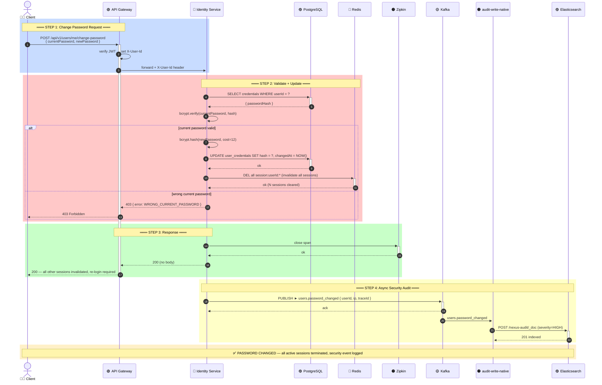

```mermaid
sequenceDiagram
    autonumber
    actor Client as 🧑‍💻 Client
    participant GW as 🟢 API Gateway
    participant ID as 🔵 Identity Service
    participant PG as 🟣 PostgreSQL
    participant RD as 🔴 Redis
    participant ZP as 🟠 Zipkin
    participant K as 🟡 Kafka
    participant AUD as 🟠 audit-write-native
    participant ES as 🟣 Elasticsearch

    rect rgb(200, 220, 255)
        Note over Client,GW: ═══ STEP 1: Change Password Request ═══
        Client->>+GW: POST /api/v1/users/me/change-password<br/>{ currentPassword, newPassword }
        GW->>GW: verify JWT → set X-User-Id
        GW->>+ID: forward + X-User-Id header
    end

    rect rgb(255, 200, 200)
        Note over ID,RD: ═══ STEP 2: Validate + Update ═══
        ID->>+PG: SELECT credentials WHERE userId = ?
        PG-->>-ID: { passwordHash }
        ID->>ID: bcrypt.verify(currentPassword, hash)
        alt current password valid
            ID->>ID: bcrypt.hash(newPassword, cost=12)
            ID->>+PG: UPDATE user_credentials SET hash = ?, changedAt = NOW()
            PG-->>-ID: ok
            ID->>+RD: DEL all session:userId:* (invalidate all sessions)
            RD-->>-ID: ok (N sessions cleared)
        else wrong current password
            ID-->>GW: 403 { error: WRONG_CURRENT_PASSWORD }
            GW-->>Client: 403 Forbidden
        end
    end

    rect rgb(200, 255, 200)
        Note over ID,GW: ═══ STEP 3: Response ═══
        ID->>+ZP: close span
        ZP-->>-ID: ok
        ID-->>GW: 200 (no body)
        GW-->>-Client: 200 — all other sessions invalidated, re-login required
    end

    rect rgb(255, 255, 200)
        Note over ID,ES: ═══ STEP 4: Async Security Audit ═══
        ID->>+K: PUBLISH ► users.password_changed { userId, ip, traceId }
        K-->>-ID: ack
        K->>+AUD: users.password_changed
        AUD->>+ES: POST /nexus-audit/_doc (severity=HIGH)
        ES-->>-AUD: 201 indexed
    end

    rect rgb(255, 240, 200)
        Note over Client,ES: ✅ PASSWORD CHANGED — all active sessions terminated, security event logged
    end
```
