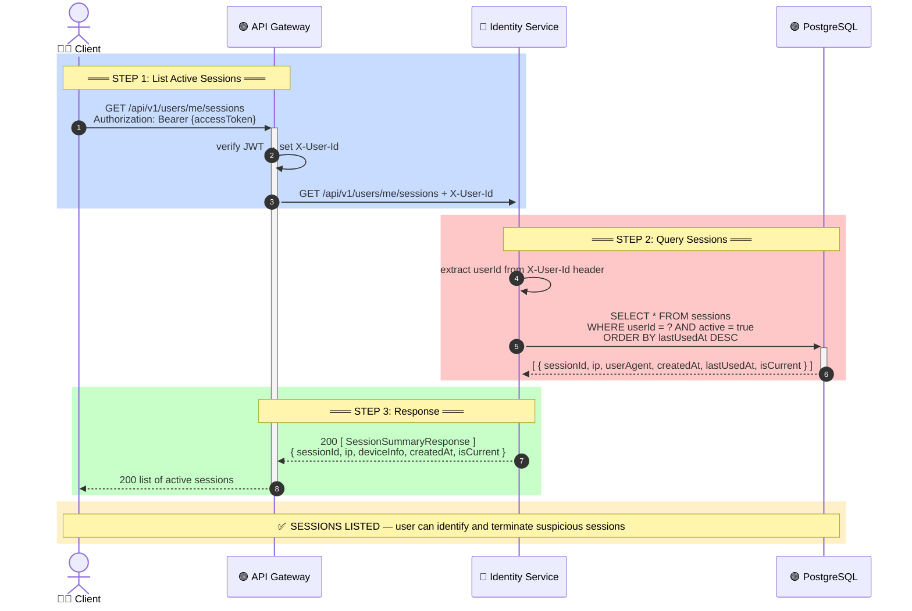

```mermaid
sequenceDiagram
    autonumber
    actor Client as 🧑‍💻 Client
    participant GW as 🟢 API Gateway
    participant ID as 🔵 Identity Service
    participant PG as 🟣 PostgreSQL

    rect rgb(200, 220, 255)
        Note over Client,GW: ═══ STEP 1: List Active Sessions ═══
        Client->>+GW: GET /api/v1/users/me/sessions<br/>Authorization: Bearer {accessToken}
        GW->>GW: verify JWT → set X-User-Id
        GW->>+ID: GET /api/v1/users/me/sessions + X-User-Id
    end

    rect rgb(255, 200, 200)
        Note over ID,PG: ═══ STEP 2: Query Sessions ═══
        ID->>ID: extract userId from X-User-Id header
        ID->>+PG: SELECT * FROM sessions<br/>WHERE userId = ? AND active = true<br/>ORDER BY lastUsedAt DESC
        PG-->>-ID: [ { sessionId, ip, userAgent, createdAt, lastUsedAt, isCurrent } ]
    end

    rect rgb(200, 255, 200)
        Note over ID,GW: ═══ STEP 3: Response ═══
        ID-->>GW: 200 [ SessionSummaryResponse ]<br/>{ sessionId, ip, deviceInfo, createdAt, isCurrent }
        GW-->>-Client: 200 list of active sessions
    end

    rect rgb(255, 240, 200)
        Note over Client,PG: ✅ SESSIONS LISTED — user can identify and terminate suspicious sessions
    end
```
