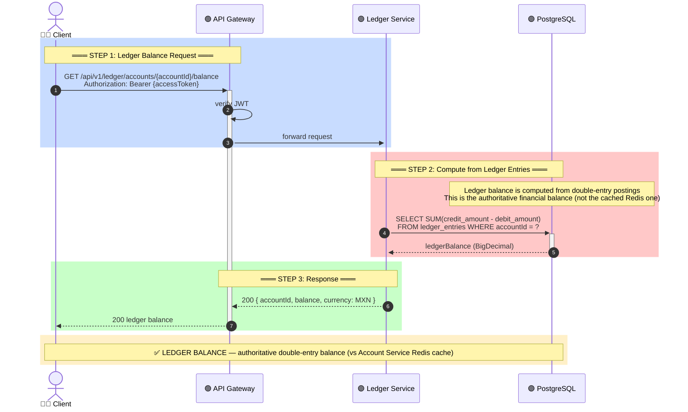

```mermaid
sequenceDiagram
    autonumber
    actor Client as 🧑‍💻 Client
    participant GW as 🟢 API Gateway
    participant LD as 🟣 Ledger Service
    participant PG as 🟣 PostgreSQL

    rect rgb(200, 220, 255)
        Note over Client,GW: ═══ STEP 1: Ledger Balance Request ═══
        Client->>+GW: GET /api/v1/ledger/accounts/{accountId}/balance<br/>Authorization: Bearer {accessToken}
        GW->>GW: verify JWT
        GW->>+LD: forward request
    end

    rect rgb(255, 200, 200)
        Note over LD,PG: ═══ STEP 2: Compute from Ledger Entries ═══
        Note over PG: Ledger balance is computed from double-entry postings<br/>This is the authoritative financial balance (not the cached Redis one)
        LD->>+PG: SELECT SUM(credit_amount - debit_amount)<br/>FROM ledger_entries WHERE accountId = ?
        PG-->>-LD: ledgerBalance (BigDecimal)
    end

    rect rgb(200, 255, 200)
        Note over LD,GW: ═══ STEP 3: Response ═══
        LD-->>GW: 200 { accountId, balance, currency: MXN }
        GW-->>-Client: 200 ledger balance
    end

    rect rgb(255, 240, 200)
        Note over Client,PG: ✅ LEDGER BALANCE — authoritative double-entry balance (vs Account Service Redis cache)
    end
```
