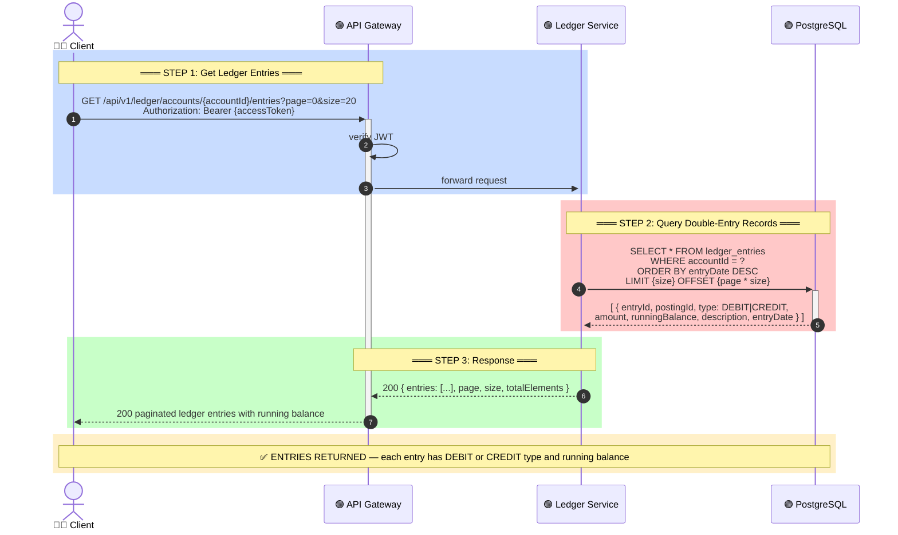

```mermaid
sequenceDiagram
    autonumber
    actor Client as 🧑‍💻 Client
    participant GW as 🟢 API Gateway
    participant LD as 🟣 Ledger Service
    participant PG as 🟣 PostgreSQL

    rect rgb(200, 220, 255)
        Note over Client,GW: ═══ STEP 1: Get Ledger Entries ═══
        Client->>+GW: GET /api/v1/ledger/accounts/{accountId}/entries?page=0&size=20<br/>Authorization: Bearer {accessToken}
        GW->>GW: verify JWT
        GW->>+LD: forward request
    end

    rect rgb(255, 200, 200)
        Note over LD,PG: ═══ STEP 2: Query Double-Entry Records ═══
        LD->>+PG: SELECT * FROM ledger_entries<br/>WHERE accountId = ?<br/>ORDER BY entryDate DESC<br/>LIMIT {size} OFFSET {page * size}
        PG-->>-LD: [ { entryId, postingId, type: DEBIT|CREDIT,<br/>    amount, runningBalance, description, entryDate } ]
    end

    rect rgb(200, 255, 200)
        Note over LD,GW: ═══ STEP 3: Response ═══
        LD-->>GW: 200 { entries: [...], page, size, totalElements }
        GW-->>-Client: 200 paginated ledger entries with running balance
    end

    rect rgb(255, 240, 200)
        Note over Client,PG: ✅ ENTRIES RETURNED — each entry has DEBIT or CREDIT type and running balance
    end
```
