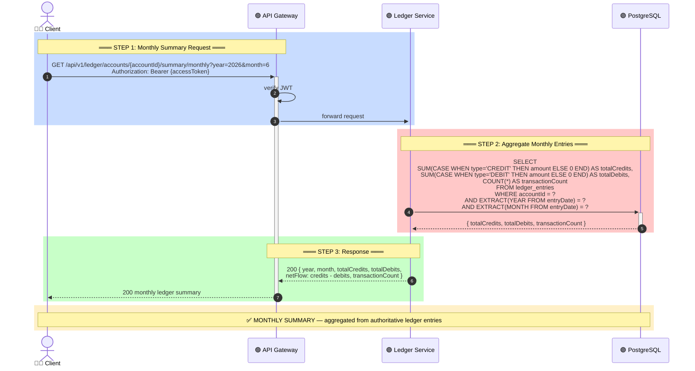

```mermaid
sequenceDiagram
    autonumber
    actor Client as 🧑‍💻 Client
    participant GW as 🟢 API Gateway
    participant LD as 🟣 Ledger Service
    participant PG as 🟣 PostgreSQL

    rect rgb(200, 220, 255)
        Note over Client,GW: ═══ STEP 1: Monthly Summary Request ═══
        Client->>+GW: GET /api/v1/ledger/accounts/{accountId}/summary/monthly?year=2026&month=6<br/>Authorization: Bearer {accessToken}
        GW->>GW: verify JWT
        GW->>+LD: forward request
    end

    rect rgb(255, 200, 200)
        Note over LD,PG: ═══ STEP 2: Aggregate Monthly Entries ═══
        LD->>+PG: SELECT<br/>  SUM(CASE WHEN type='CREDIT' THEN amount ELSE 0 END) AS totalCredits,<br/>  SUM(CASE WHEN type='DEBIT' THEN amount ELSE 0 END) AS totalDebits,<br/>  COUNT(*) AS transactionCount<br/>FROM ledger_entries<br/>WHERE accountId = ?<br/>AND EXTRACT(YEAR FROM entryDate) = ?<br/>AND EXTRACT(MONTH FROM entryDate) = ?
        PG-->>-LD: { totalCredits, totalDebits, transactionCount }
    end

    rect rgb(200, 255, 200)
        Note over LD,GW: ═══ STEP 3: Response ═══
        LD-->>GW: 200 { year, month, totalCredits, totalDebits,<br/>  netFlow: credits - debits, transactionCount }
        GW-->>-Client: 200 monthly ledger summary
    end

    rect rgb(255, 240, 200)
        Note over Client,PG: ✅ MONTHLY SUMMARY — aggregated from authoritative ledger entries
    end
```
