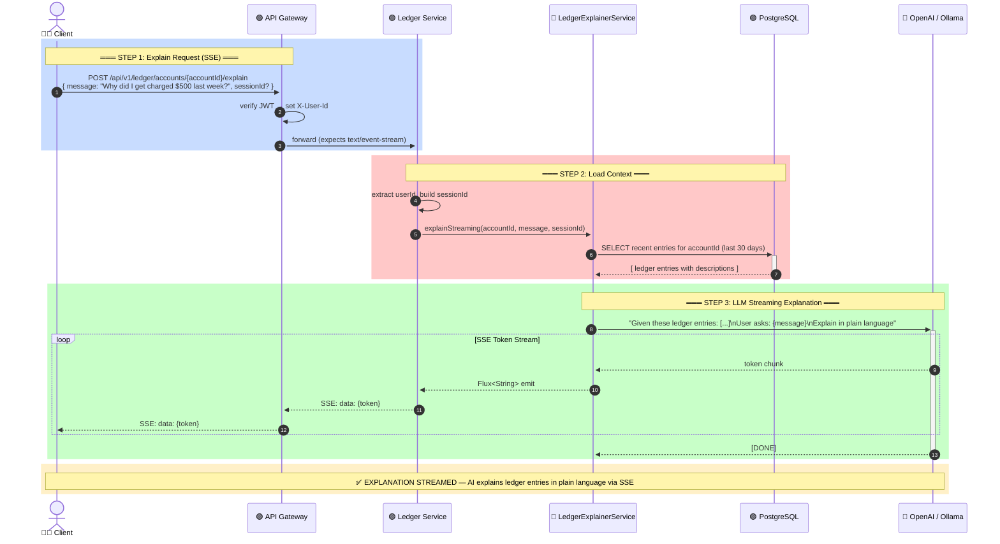

```mermaid
sequenceDiagram
    autonumber
    actor Client as 🧑‍💻 Client
    participant GW as 🟢 API Gateway
    participant LD as 🟣 Ledger Service
    participant EX as 🤖 LedgerExplainerService
    participant PG as 🟣 PostgreSQL
    participant LLM as 🧠 OpenAI / Ollama

    rect rgb(200, 220, 255)
        Note over Client,GW: ═══ STEP 1: Explain Request (SSE) ═══
        Client->>+GW: POST /api/v1/ledger/accounts/{accountId}/explain<br/>{ message: "Why did I get charged $500 last week?", sessionId? }
        GW->>GW: verify JWT → set X-User-Id
        GW->>+LD: forward (expects text/event-stream)
    end

    rect rgb(255, 200, 200)
        Note over LD,PG: ═══ STEP 2: Load Context ═══
        LD->>LD: extract userId, build sessionId
        LD->>+EX: explainStreaming(accountId, message, sessionId)
        EX->>+PG: SELECT recent entries for accountId (last 30 days)
        PG-->>-EX: [ ledger entries with descriptions ]
    end

    rect rgb(200, 255, 200)
        Note over EX,LLM: ═══ STEP 3: LLM Streaming Explanation ═══
        EX->>+LLM: "Given these ledger entries: [...]\nUser asks: {message}\nExplain in plain language"
        loop SSE Token Stream
            LLM-->>EX: token chunk
            EX-->>LD: Flux<String> emit
            LD-->>GW: SSE: data: {token}
            GW-->>Client: SSE: data: {token}
        end
        LLM-->>-EX: [DONE]
    end

    rect rgb(255, 240, 200)
        Note over Client,LLM: ✅ EXPLANATION STREAMED — AI explains ledger entries in plain language via SSE
    end
```
