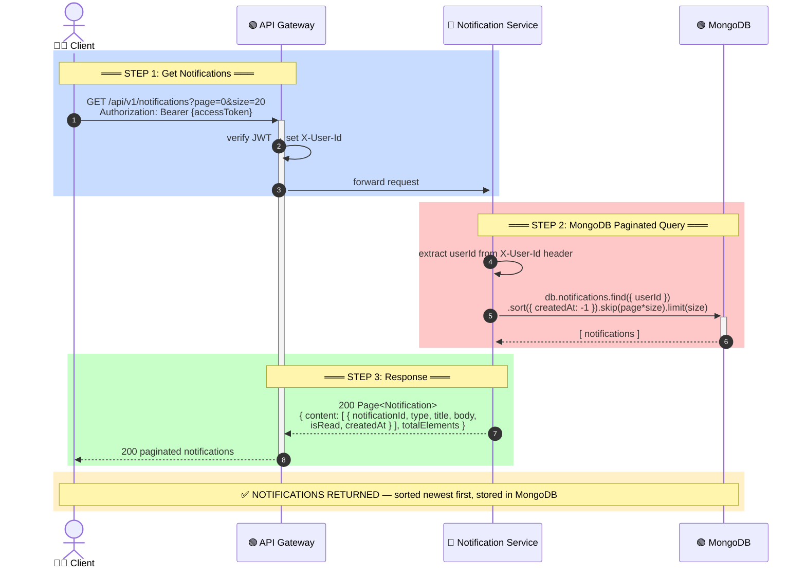

```mermaid
sequenceDiagram
    autonumber
    actor Client as 🧑‍💻 Client
    participant GW as 🟢 API Gateway
    participant NOT as 🔵 Notification Service
    participant MDB as 🟢 MongoDB

    rect rgb(200, 220, 255)
        Note over Client,GW: ═══ STEP 1: Get Notifications ═══
        Client->>+GW: GET /api/v1/notifications?page=0&size=20<br/>Authorization: Bearer {accessToken}
        GW->>GW: verify JWT → set X-User-Id
        GW->>+NOT: forward request
    end

    rect rgb(255, 200, 200)
        Note over NOT,MDB: ═══ STEP 2: MongoDB Paginated Query ═══
        NOT->>NOT: extract userId from X-User-Id header
        NOT->>+MDB: db.notifications.find({ userId })<br/>.sort({ createdAt: -1 }).skip(page*size).limit(size)
        MDB-->>-NOT: [ notifications ]
    end

    rect rgb(200, 255, 200)
        Note over NOT,GW: ═══ STEP 3: Response ═══
        NOT-->>GW: 200 Page<Notification><br/>{ content: [ { notificationId, type, title, body,<br/>  isRead, createdAt } ], totalElements }
        GW-->>-Client: 200 paginated notifications
    end

    rect rgb(255, 240, 200)
        Note over Client,MDB: ✅ NOTIFICATIONS RETURNED — sorted newest first, stored in MongoDB
    end
```
