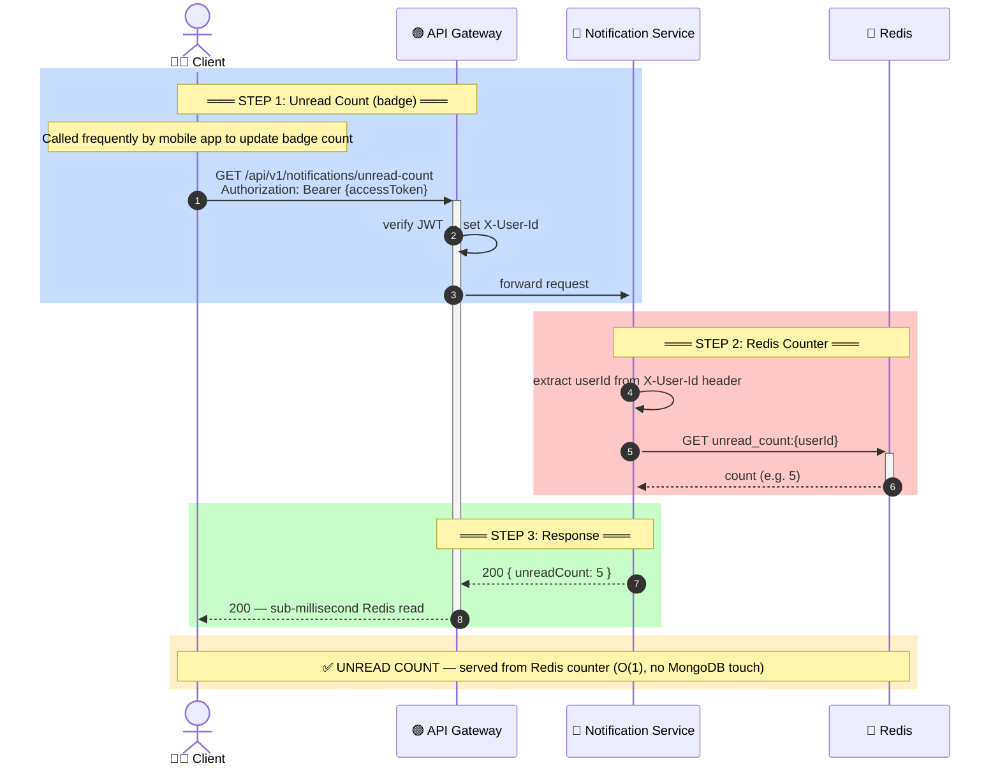

```mermaid
sequenceDiagram
    autonumber
    actor Client as 🧑‍💻 Client
    participant GW as 🟢 API Gateway
    participant NOT as 🔵 Notification Service
    participant RD as 🔴 Redis

    rect rgb(200, 220, 255)
        Note over Client,GW: ═══ STEP 1: Unread Count (badge) ═══
        Note over Client: Called frequently by mobile app to update badge count
        Client->>+GW: GET /api/v1/notifications/unread-count<br/>Authorization: Bearer {accessToken}
        GW->>GW: verify JWT → set X-User-Id
        GW->>+NOT: forward request
    end

    rect rgb(255, 200, 200)
        Note over NOT,RD: ═══ STEP 2: Redis Counter ═══
        NOT->>NOT: extract userId from X-User-Id header
        NOT->>+RD: GET unread_count:{userId}
        RD-->>-NOT: count (e.g. 5)
    end

    rect rgb(200, 255, 200)
        Note over NOT,GW: ═══ STEP 3: Response ═══
        NOT-->>GW: 200 { unreadCount: 5 }
        GW-->>-Client: 200 — sub-millisecond Redis read
    end

    rect rgb(255, 240, 200)
        Note over Client,RD: ✅ UNREAD COUNT — served from Redis counter (O(1), no MongoDB touch)
    end
```
