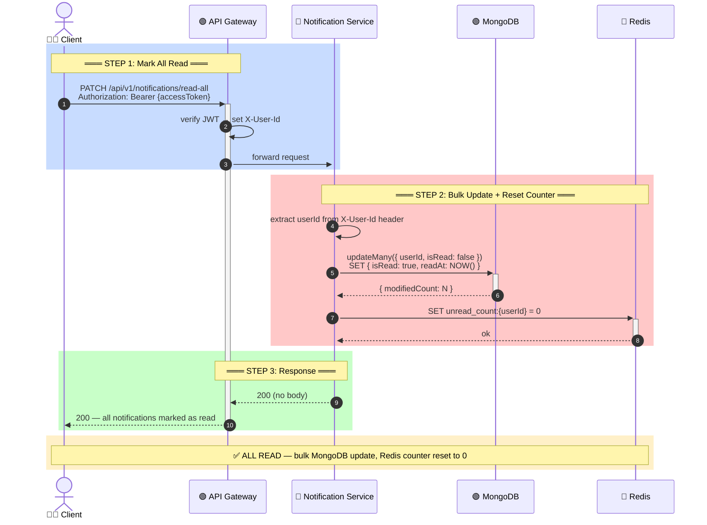

```mermaid
sequenceDiagram
    autonumber
    actor Client as 🧑‍💻 Client
    participant GW as 🟢 API Gateway
    participant NOT as 🔵 Notification Service
    participant MDB as 🟢 MongoDB
    participant RD as 🔴 Redis

    rect rgb(200, 220, 255)
        Note over Client,GW: ═══ STEP 1: Mark All Read ═══
        Client->>+GW: PATCH /api/v1/notifications/read-all<br/>Authorization: Bearer {accessToken}
        GW->>GW: verify JWT → set X-User-Id
        GW->>+NOT: forward request
    end

    rect rgb(255, 200, 200)
        Note over NOT,RD: ═══ STEP 2: Bulk Update + Reset Counter ═══
        NOT->>NOT: extract userId from X-User-Id header
        NOT->>+MDB: updateMany({ userId, isRead: false })<br/>SET { isRead: true, readAt: NOW() }
        MDB-->>-NOT: { modifiedCount: N }
        NOT->>+RD: SET unread_count:{userId} = 0
        RD-->>-NOT: ok
    end

    rect rgb(200, 255, 200)
        Note over NOT,GW: ═══ STEP 3: Response ═══
        NOT-->>GW: 200 (no body)
        GW-->>-Client: 200 — all notifications marked as read
    end

    rect rgb(255, 240, 200)
        Note over Client,RD: ✅ ALL READ — bulk MongoDB update, Redis counter reset to 0
    end
```
