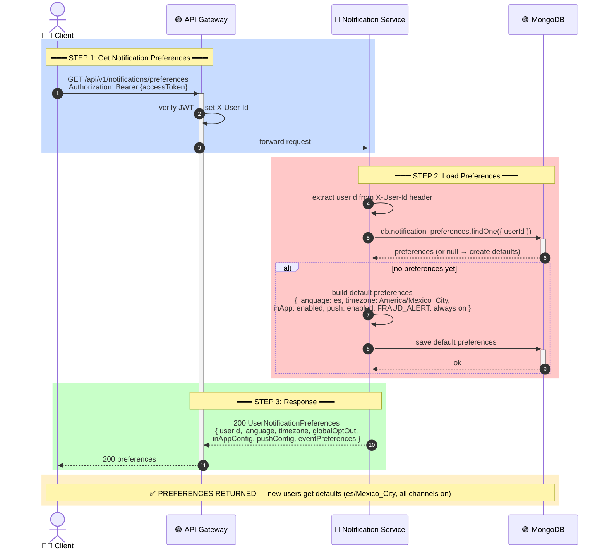

```mermaid
sequenceDiagram
    autonumber
    actor Client as 🧑‍💻 Client
    participant GW as 🟢 API Gateway
    participant NOT as 🔵 Notification Service
    participant MDB as 🟢 MongoDB

    rect rgb(200, 220, 255)
        Note over Client,GW: ═══ STEP 1: Get Notification Preferences ═══
        Client->>+GW: GET /api/v1/notifications/preferences<br/>Authorization: Bearer {accessToken}
        GW->>GW: verify JWT → set X-User-Id
        GW->>+NOT: forward request
    end

    rect rgb(255, 200, 200)
        Note over NOT,MDB: ═══ STEP 2: Load Preferences ═══
        NOT->>NOT: extract userId from X-User-Id header
        NOT->>+MDB: db.notification_preferences.findOne({ userId })
        MDB-->>-NOT: preferences (or null → create defaults)
        alt no preferences yet
            NOT->>NOT: build default preferences<br/>{ language: es, timezone: America/Mexico_City,<br/>  inApp: enabled, push: enabled, FRAUD_ALERT: always on }
            NOT->>+MDB: save default preferences
            MDB-->>-NOT: ok
        end
    end

    rect rgb(200, 255, 200)
        Note over NOT,GW: ═══ STEP 3: Response ═══
        NOT-->>GW: 200 UserNotificationPreferences<br/>{ userId, language, timezone, globalOptOut,<br/>  inAppConfig, pushConfig, eventPreferences }
        GW-->>-Client: 200 preferences
    end

    rect rgb(255, 240, 200)
        Note over Client,MDB: ✅ PREFERENCES RETURNED — new users get defaults (es/Mexico_City, all channels on)
    end
```
