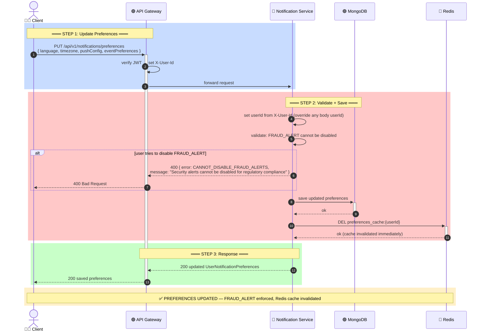

```mermaid
sequenceDiagram
    autonumber
    actor Client as 🧑‍💻 Client
    participant GW as 🟢 API Gateway
    participant NOT as 🔵 Notification Service
    participant MDB as 🟢 MongoDB
    participant RD as 🔴 Redis

    rect rgb(200, 220, 255)
        Note over Client,GW: ═══ STEP 1: Update Preferences ═══
        Client->>+GW: PUT /api/v1/notifications/preferences<br/>{ language, timezone, pushConfig, eventPreferences }
        GW->>GW: verify JWT → set X-User-Id
        GW->>+NOT: forward request
    end

    rect rgb(255, 200, 200)
        Note over NOT,MDB: ═══ STEP 2: Validate + Save ═══
        NOT->>NOT: set userId from X-User-Id (override any body userId)
        NOT->>NOT: validate: FRAUD_ALERT cannot be disabled
        alt user tries to disable FRAUD_ALERT
            NOT-->>GW: 400 { error: CANNOT_DISABLE_FRAUD_ALERTS,<br/>  message: "Security alerts cannot be disabled for regulatory compliance" }
            GW-->>Client: 400 Bad Request
        end
        NOT->>+MDB: save updated preferences
        MDB-->>-NOT: ok
        NOT->>+RD: DEL preferences_cache:{userId}
        RD-->>-NOT: ok (cache invalidated immediately)
    end

    rect rgb(200, 255, 200)
        Note over NOT,GW: ═══ STEP 3: Response ═══
        NOT-->>GW: 200 updated UserNotificationPreferences
        GW-->>-Client: 200 saved preferences
    end

    rect rgb(255, 240, 200)
        Note over Client,RD: ✅ PREFERENCES UPDATED — FRAUD_ALERT enforced, Redis cache invalidated
    end
```
