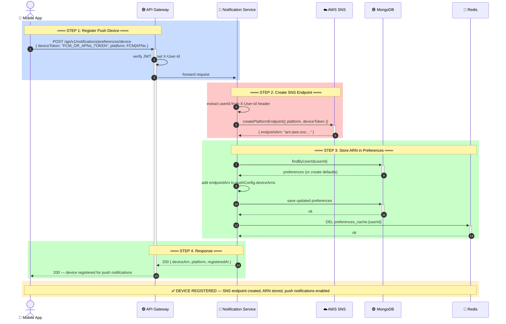

```mermaid
sequenceDiagram
    autonumber
    actor Client as 📱 Mobile App
    participant GW as 🟢 API Gateway
    participant NOT as 🔵 Notification Service
    participant SNS as ☁️ AWS SNS
    participant MDB as 🟢 MongoDB
    participant RD as 🔴 Redis

    rect rgb(200, 220, 255)
        Note over Client,GW: ═══ STEP 1: Register Push Device ═══
        Client->>+GW: POST /api/v1/notifications/preferences/device<br/>{ deviceToken: "FCM_OR_APNs_TOKEN", platform: FCM|APNs }
        GW->>GW: verify JWT → set X-User-Id
        GW->>+NOT: forward request
    end

    rect rgb(255, 200, 200)
        Note over NOT,SNS: ═══ STEP 2: Create SNS Endpoint ═══
        NOT->>NOT: extract userId from X-User-Id header
        NOT->>+SNS: createPlatformEndpoint({ platform, deviceToken })
        SNS-->>-NOT: { endpointArn: "arn:aws:sns:..." }
    end

    rect rgb(200, 255, 200)
        Note over NOT,RD: ═══ STEP 3: Store ARN in Preferences ═══
        NOT->>+MDB: findByUserId(userId)
        MDB-->>-NOT: preferences (or create defaults)
        NOT->>NOT: add endpointArn to pushConfig.deviceArns
        NOT->>+MDB: save updated preferences
        MDB-->>-NOT: ok
        NOT->>+RD: DEL preferences_cache:{userId}
        RD-->>-NOT: ok
    end

    rect rgb(200, 255, 200)
        Note over NOT,GW: ═══ STEP 4: Response ═══
        NOT-->>GW: 200 { deviceArn, platform, registeredAt }
        GW-->>-Client: 200 — device registered for push notifications
    end

    rect rgb(255, 240, 200)
        Note over Client,RD: ✅ DEVICE REGISTERED — SNS endpoint created, ARN stored, push notifications enabled
    end
```
