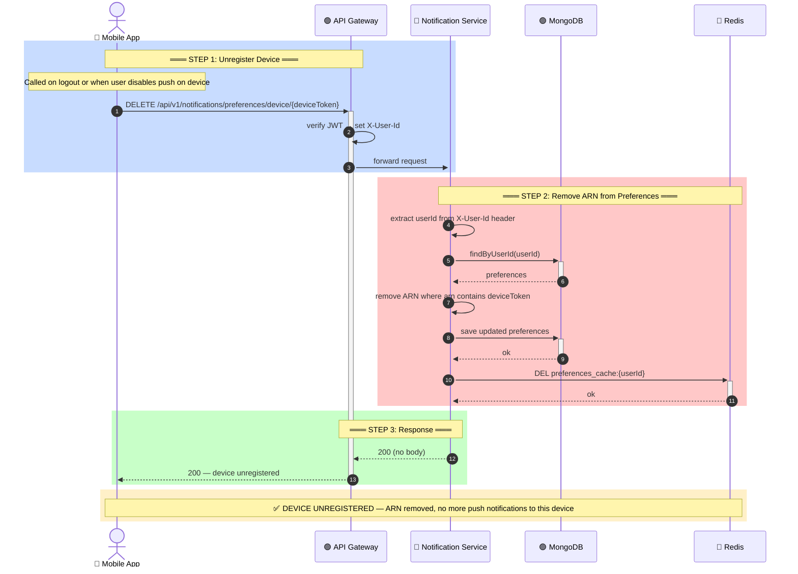

```mermaid
sequenceDiagram
    autonumber
    actor Client as 📱 Mobile App
    participant GW as 🟢 API Gateway
    participant NOT as 🔵 Notification Service
    participant MDB as 🟢 MongoDB
    participant RD as 🔴 Redis

    rect rgb(200, 220, 255)
        Note over Client,GW: ═══ STEP 1: Unregister Device ═══
        Note over Client: Called on logout or when user disables push on device
        Client->>+GW: DELETE /api/v1/notifications/preferences/device/{deviceToken}
        GW->>GW: verify JWT → set X-User-Id
        GW->>+NOT: forward request
    end

    rect rgb(255, 200, 200)
        Note over NOT,RD: ═══ STEP 2: Remove ARN from Preferences ═══
        NOT->>NOT: extract userId from X-User-Id header
        NOT->>+MDB: findByUserId(userId)
        MDB-->>-NOT: preferences
        NOT->>NOT: remove ARN where arn contains deviceToken
        NOT->>+MDB: save updated preferences
        MDB-->>-NOT: ok
        NOT->>+RD: DEL preferences_cache:{userId}
        RD-->>-NOT: ok
    end

    rect rgb(200, 255, 200)
        Note over NOT,GW: ═══ STEP 3: Response ═══
        NOT-->>GW: 200 (no body)
        GW-->>-Client: 200 — device unregistered
    end

    rect rgb(255, 240, 200)
        Note over Client,RD: ✅ DEVICE UNREGISTERED — ARN removed, no more push notifications to this device
    end
```
