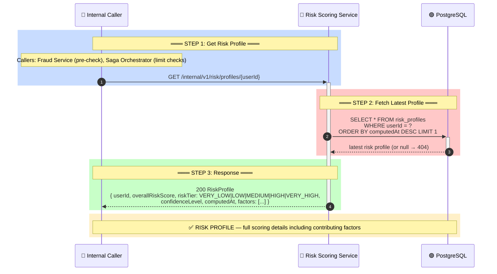

```mermaid
sequenceDiagram
    autonumber
    participant CALLER as 🔵 Internal Caller
    participant RS as 🔴 Risk Scoring Service
    participant PG as 🟣 PostgreSQL

    rect rgb(200, 220, 255)
        Note over CALLER,RS: ═══ STEP 1: Get Risk Profile ═══
        Note over CALLER: Callers: Fraud Service (pre-check), Saga Orchestrator (limit checks)
        CALLER->>+RS: GET /internal/v1/risk/profiles/{userId}
    end

    rect rgb(255, 200, 200)
        Note over RS,PG: ═══ STEP 2: Fetch Latest Profile ═══
        RS->>+PG: SELECT * FROM risk_profiles<br/>WHERE userId = ?<br/>ORDER BY computedAt DESC LIMIT 1
        PG-->>-RS: latest risk profile (or null → 404)
    end

    rect rgb(200, 255, 200)
        Note over RS,CALLER: ═══ STEP 3: Response ═══
        RS-->>-CALLER: 200 RiskProfile<br/>{ userId, overallRiskScore, riskTier: VERY_LOW|LOW|MEDIUM|HIGH|VERY_HIGH,<br/>  confidenceLevel, computedAt, factors: [...] }
    end

    rect rgb(255, 240, 200)
        Note over CALLER,PG: ✅ RISK PROFILE — full scoring details including contributing factors
    end
```
