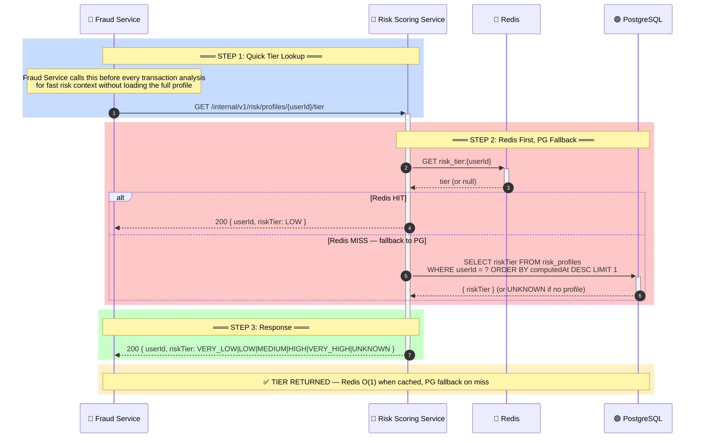

```mermaid
sequenceDiagram
    autonumber
    participant FR as 🔴 Fraud Service
    participant RS as 🔴 Risk Scoring Service
    participant RD as 🔴 Redis
    participant PG as 🟣 PostgreSQL

    rect rgb(200, 220, 255)
        Note over FR,RS: ═══ STEP 1: Quick Tier Lookup ═══
        Note over FR: Fraud Service calls this before every transaction analysis<br/>for fast risk context without loading the full profile
        FR->>+RS: GET /internal/v1/risk/profiles/{userId}/tier
    end

    rect rgb(255, 200, 200)
        Note over RS,PG: ═══ STEP 2: Redis First, PG Fallback ═══
        RS->>+RD: GET risk_tier:{userId}
        RD-->>-RS: tier (or null)
        alt Redis HIT
            RS-->>FR: 200 { userId, riskTier: LOW }
        else Redis MISS — fallback to PG
            RS->>+PG: SELECT riskTier FROM risk_profiles<br/>WHERE userId = ? ORDER BY computedAt DESC LIMIT 1
            PG-->>-RS: { riskTier } (or UNKNOWN if no profile)
        end
    end

    rect rgb(200, 255, 200)
        Note over RS,FR: ═══ STEP 3: Response ═══
        RS-->>-FR: 200 { userId, riskTier: VERY_LOW|LOW|MEDIUM|HIGH|VERY_HIGH|UNKNOWN }
    end

    rect rgb(255, 240, 200)
        Note over FR,PG: ✅ TIER RETURNED — Redis O(1) when cached, PG fallback on miss
    end
```
