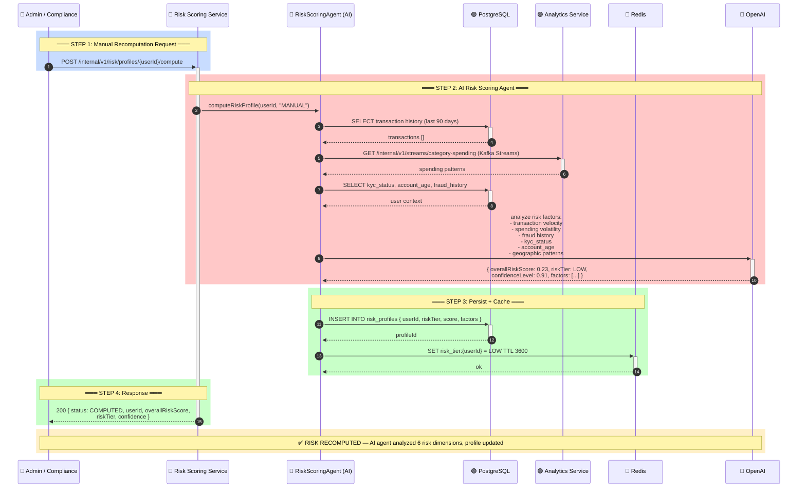

```mermaid
sequenceDiagram
    autonumber
    participant ADMIN as 👮 Admin / Compliance
    participant RS as 🔴 Risk Scoring Service
    participant AG as 🤖 RiskScoringAgent (AI)
    participant PG as 🟣 PostgreSQL
    participant AN as 🟢 Analytics Service
    participant RD as 🔴 Redis
    participant LLM as 🧠 OpenAI

    rect rgb(200, 220, 255)
        Note over ADMIN,RS: ═══ STEP 1: Manual Recomputation Request ═══
        ADMIN->>+RS: POST /internal/v1/risk/profiles/{userId}/compute
    end

    rect rgb(255, 200, 200)
        Note over RS,LLM: ═══ STEP 2: AI Risk Scoring Agent ═══
        RS->>+AG: computeRiskProfile(userId, "MANUAL")
        AG->>+PG: SELECT transaction history (last 90 days)
        PG-->>-AG: transactions []
        AG->>+AN: GET /internal/v1/streams/category-spending (Kafka Streams)
        AN-->>-AG: spending patterns
        AG->>+PG: SELECT kyc_status, account_age, fraud_history
        PG-->>-AG: user context
        AG->>+LLM: analyze risk factors:<br/>- transaction velocity<br/>- spending volatility<br/>- fraud history<br/>- kyc_status<br/>- account_age<br/>- geographic patterns
        LLM-->>-AG: { overallRiskScore: 0.23, riskTier: LOW,<br/>  confidenceLevel: 0.91, factors: [...] }
    end

    rect rgb(200, 255, 200)
        Note over AG,RD: ═══ STEP 3: Persist + Cache ═══
        AG->>+PG: INSERT INTO risk_profiles { userId, riskTier, score, factors }
        PG-->>-AG: profileId
        AG->>+RD: SET risk_tier:{userId} = LOW TTL 3600
        RD-->>-AG: ok
    end

    rect rgb(200, 255, 200)
        Note over RS,ADMIN: ═══ STEP 4: Response ═══
        RS-->>-ADMIN: 200 { status: COMPUTED, userId, overallRiskScore,<br/>  riskTier, confidence }
    end

    rect rgb(255, 240, 200)
        Note over ADMIN,LLM: ✅ RISK RECOMPUTED — AI agent analyzed 6 risk dimensions, profile updated
    end
```
